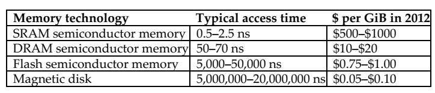

# 第5章 大而快：层次化存储
局部性原理：时间局部性（某个最近访问的数据项可能在不久的将来被再次访问），空间局部性（某个最近访问的数据项地址相邻的数据项可能也很快会被访问）。  
层次化存储对局部性的利用：将最近访问过的数据留在离处理器更近的存储层次中（时间局部性），将包含多个连续字的数据块移动到更上层存储（空间局部性）。

需要关注的参数：命中率（失效率），命中时间，失效损失。

## 存储技术

SRAM：通常有一个读写端口，对任意位置的数据访问时间固定，但读写操作的访问时间不同。不需要刷新电路，在待机模式下，只需要最小的功率来保持电荷。今天，所有的高速缓存都集中到了处理器芯片上（不再需要独立的 SRAM 芯片）。  
DRAM：使用电容保存电荷以保存数据。使用单个晶体管来访问、读取、改写电荷。必须进行周期性的刷新（电荷可以保持几微秒）。DRAM 使用两级译码电路，可以使用一个读周期紧跟一个写周期的方式一次性完成整行刷新。行的结构有利于 DRAM 改善性能。DRAM 中缓存行的数据以便重复访问。  
SDRAM：同步 DRAM，添加时钟以消除内存和处理器之间的同步问题。其中速度最快的为双倍数据传输率 DDR SDRAM，使用时钟的上升沿和下降沿进行数据传输。  
闪存：电可擦除的可编程只读存储器 EEPROM。写操作会对器件本身产生磨损。  
磁盘：由盘片组成，使用可移动的转臂读写信息。

## Cache
使用组相联结构来降低 cache 失效率，使用多级 cache 结构来降低失效代价。

在多级 Cache 的设计中，每一级 cache 的设计考虑明显不同。特别地，在两级 cache 中，其一级 cache 关注命中时间的最小化（以提高工作频率，或关注流水级数的减少），另一级则关注失效率（以降低长访问延迟带来的失效代价）。  
一级 cache 会使用较小的块容量，以配合较小的 cache 容量，降低失效代价。而二级 cache 会有更大的 cache 容量（因为其访问时间并没有那么关键），同时也会使用更大的数据块和更高的相联度。

许多软件优化技术通过重用 cache 中的数据来大幅度提升处理器性能，通过改善程序的时间局部性来降低失效率。

处理数组通常讲数组元素按照访问顺序存放在存储器中，以获得性能上的提升。但若同时需要按行和按列访问数组，则需要分块算法对子矩阵（或数据块）来进行操作。这一算法的核心思想是，在替换之前对已经在 cache 中的数据进行尽可能多的访问（提高程序的时间局部性以减少 cache 失效）。  
分块思想不仅可以减少 cache 的失效次数，还能协助寄存器分配（采用较少规模的数据块，可以将数据块保存在寄存器中，降低程序访问存储的次数，进一步提升性能）。

## 可靠的存储器层次
增加可靠性的最好办法是冗余。

**可靠性**：一个系统能够持续提供用户需求的服务的度量（从参考时刻到失效时刻的时间间隔）。常见的度量方法是**平均无故障时间** MTTF。另一个术语是**年度失效率** AFR，给定 MTTF 一年内预期的器件失效百分比。  
服务中断则使用**平均修复时间** MTTR 来衡量。**平均失效间隔时间** MTBF=MTTF+MTTR。  
可用性：系统正常工作时间在两次服务中断间隔时间中所占的比例 $\frac{MTTF}{MTTF+MTTR}$。  
可靠性和可用性是可量化的。  
术语**故障**用来指称器件的失效。

提高 MTTF 的方法：  
1. 故障避免技术：合理构建系统来避免故障的出现。  
2. 故障容忍技术：使用冗余技术（即使出现故障也能按照需求服务）。  
3. 故障预测技术：预测故障的出现和构建，从而允许在器件故障之前进行替换。

汉明编码：纠正 1 位错，检测 2 位错。  
汉明距离：两个等长的二进制数对应位置不同的位的数量。

在大型系统中，出现多位错的情况与整个内存芯片出错的情况联系很大。许多公司引入了类似磁盘 RAID 的方式，将数据和校验码分散开，这样当一个内存芯片全部出错时，可以通过其它内存芯片对丢失的内容进行重建。  
在网络系统中，可能出现突发性错误，其解决办法是使用循环冗余校验。

## 虚拟机
虚拟机受到关注：隔离和安全性，标准操作系统在安全性和可靠性方面存在缺陷，共享计算（特别是云计算），处理器速度提升使得虚拟机的开销变得可以接受。

虚拟机在二进制指令系统体系结构 ISA 的层次上提供一个完整的系统及环境。  
支持虚拟机的软件：虚拟机监视器 VMM。VMM 能够管理软件（提供一个可以运行整个软件堆的抽象），管理硬件（独立运行的服务器共享硬件资源，或将正在运行的 VM 迁移到另外的计算机上以满足负载均衡或硬件故障修复的需求）。

允许虚拟机直接在硬件上运行的 ISA 被称为**可虚拟化的**，如 IBM 370 和 RISC-V，不包括 x86 和大多数 RISC 架构（如 ARMv7 和 MIPS）。

历史上，IBM 大型机硬件和 VMM 采用如下方法提高虚拟机的性能：  
1. 降低处理器虚拟化的开销。  
2. 降低由虚拟化引起的中断开销。  
3. 将中断交给响应的 VM 而不调用 VMM，从而降低中断开销。

在用户模式下，RISC-V 可以使所有特权指令内陷，因此支持传统虚拟化，其中客户操作系统以用户模式运行，VMM 以管理模式运行。

## 虚拟存储
虚拟存储：cache 对主存的加速，主存对磁盘的加速。  
主要动机：允许在多个程序之间高效安全地共享内存（主要），消除小而受限的主存容量对程序设计造成的影响。

缺页失效的高成本是许多设计选择虚拟存储系统的原因，并导致了设计虚拟存储系统时的几个关键决策：  
1. 页应该足够大以分摊长访问时间。  
2. 尽量设计能降低缺页失效率的组织结构。使用的主要技术是允许存储中的页以全相联的方式放置。  
3. 缺页失效可由软件处理。一来可以降低开销（与磁盘访问时间相比），二来可以使用算法来选择如何放置页面。  
4. 写穿透策略对虚拟存储不合适（写入时间过长），故虚拟存储系统通常采用写回策略。

> 另外还有一种段式存储，是可变长度的地址映射策略。由于段的大小可变，所以还需要进行边界检查。分段策略能支持更强大的保护和地址空间的共享，

