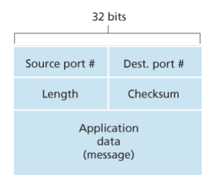
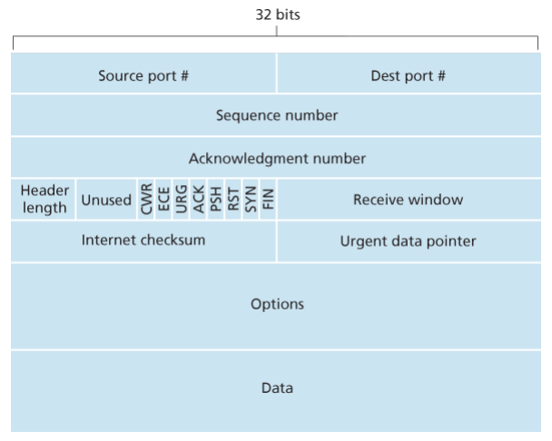
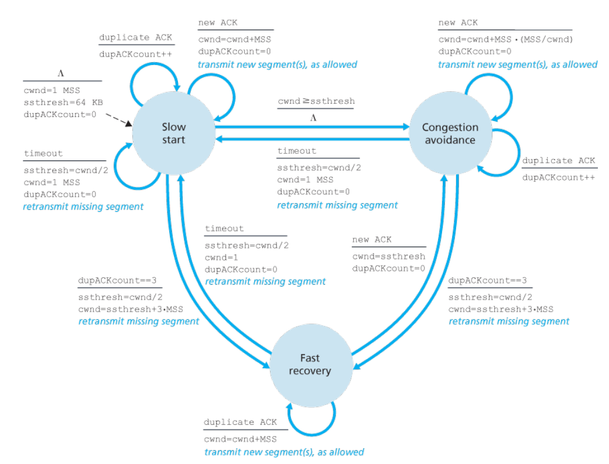

# 第3章 运输层

## 概述和运输层服务
运输层：提供逻辑通信，在端系统（而不是路由器）实现。运输层分组称为报文段 segment。  
UDP 和 TCP 提供的服务模型：将两个端系统之间 IP（即网络层）的交付服务扩展为两个进程之间的交付服务。涉及运输层的多路复用和多路分解。  
UDP：仅提供数据交付和差错检查两种服务。  
TCP：还提供可靠数据传输和拥塞控制服务。

## 多路复用和多路分解
进程使用套接字作为与网络数据交互的接口，而运输层负责将报文与套接字对应定位。在运输层报文中包含了若干字段用于识别，一般包括源端口号字段和目的端口号字段。  
UDP 套接字由二元组（目的IP地址，目的端口号）标识，这意味着如果有两个 UDP 报文的目的 IP 地址和目的端口号相同，无论其源 IP 地址或源端口号是否相同，都会转发到相同的目的套接字。  
TCP 套接字由四元组标识，这意味着当源不同的时候也会转发到不同的套接字，但例外是 TCP 中初始创建连接的请求。

## 无连接运输：UDP
UDP 仅做运输协议能够做的最少工作。其仅将从应用程序接收到的数据附加上源和目的地的端口号字段，以及其它两个小字段，然后就将形成的报文交给网络层。  
UDP 的优点：应用层对发送什么数据以及合适发送数据的控制更为精细，不需要提前建立连接（较少时延），不需要维护连接状态，分组首部开销小。  
UDP 报文结构如下：

UDP 的检验和 checksum 提供了简单的差错检测功能。在发送方，UDP 对报文中的所有 16 比特字段的和进行反码运算，溢出时进行回卷，将得到的结果放到报文段中的checksum 字段。这样，在接收方，如果所有的 16 比特字段回卷和为全 1 则说明没有引入差错。  
UDP 仅能检测差错，无力恢复受损的数据，遇到受损的报文段只能丢弃或者对应用程序提出警告。

## 可靠数据传输原理
可靠数据传输为上层提供的服务抽象：数据通过一条可靠的信道传输，其传输数据比特不会损坏或丢失，且所有数据按照其发送顺序进行交付。  
自动重传请求 ARQ 协议：处理比特差错，包括差错检测、接收方反馈和重传三个功能。接收方通过肯定确认和否定确认让发送方得知哪些内容被正确接收，哪些内容有误需要重传。  
引入序号：当 ACK 或 NAK 分组本身受损时，采用冗余分组的方式重传当前分组，为了让接收方能正确识别发送来的数据是新数据还是冗余的数据，在字段中引入序号来进行区分。  
处理丢包：当发送方等待一定时间后仍没有收到回复，则直接开始重传。发送方为每一个发送的分组设置一个倒数定时器，用于超时重传。  
流水线化：不采用停等的方式，而是允许发送方发送多个分组而无需等待确认。将每一部分的功能拆分成流水线的形式，大大提高了发包的效率和带宽的利用率。

流水线化后，编号也更加复杂，同时对于重传有两种基本方式。  
其一是回退 N 步 GBN，该协议进行累计确认，即当确认序号 n 时标识接收方已经正确接收到 n 及其之前的所有数据。接收方接收到序号为 n 的分组时，如果前面所有分组均已收到则返回 ACK，否则其它情况均返回最近按序接收的最后一个 ACK ，即接收方丢弃所有失序分组。在这一方法中，接收方不需要缓存任何失序分组。  
其二是选择重传 SR，让发送方仅重传那些它怀疑在接收方出错的分组。接收方确认正常接收的分组，但不考虑其顺序，缓存失序的分组直到其前面的丢失分组均收到为止。

## 面向连接的运输：TCP
TCP 的连接是逻辑连接，即其共同状态仅保留在两个通信端系统的 TCP 程序中，而中间的其它网络元素（比如路由器和链路层交换机）对其无感知。  
TCP 连接提供全双工服务，是点到点的连接。  
进程将数据通过套接字传递给 TCP 后，TCP 程序将数据首先存放在该连接的发送缓存中，这一缓存在握手时创建，然后 TCP 程序在其方便的时候以报文段的形式发送数据。  
TCP 从缓存中去除并放入报文段的数据量受限于最大报文长度 MSS，而 MSS 通常由最大链路层帧长度 MTU 来设置以保证 TCP 报文段的总长能适合链路层报文。

### TCP 报文段结构
TCP 报文结构图示如下

当发送大文件时，TCP 会将文件切块，分别发送。  
TCP 使用序号和确认号来对可靠传输进行标识，这一序号建立在传输的字节流上，而不是传输的报文段序列上。由于 TCP 是全双工的，所以从 A 发往 B 的报文中的确认号是 A 希望 B 接下来发送的下一个数据字节流的序号。  
TCP 使用累积确认，即只确认流中到第一个丢失字节为止的字节。  
TCP 连接的双方均可以随机地选择初始序号，以减少可能出现的冲突。

### 往返时间的估计与超时
大部分 TCP 实现中不会为每一个报文统计 RTT，而是采样其中的一部分。TCP 同样不会对已被重传的报文段计算 RTT。这一 RTT 可以记为 SampleRTT。  
为减少网络波动带来的问题，通常 TCP 算法中都会采用某种对 SampleRTT 基于时间平均的做法，记为 $EstimatedRTT=(1-\alpha)\times EstimatedRTT+\alpha\times SampleRTT$，这一平均在统计学中称为指数加权移动平均。另外还有测量 RTT 的波动大小 $DevRTT=(1-\beta)\times DevRTT+\beta\times |SampleRTT-EstimatedRTT|$。  
基于上述一些统计参数，可以估算出重传超时的时间间隔，一个例子是 $TimeoutInterval = EstimatedRTT + 4\times DevRTT$。

### 可靠数据传输
定时器的管理需要相当大的开销，所以通常使用单一的重传定时器而不是将每个报文都与一个单独的定时器关联。  
当发生超时后，TCP 重传使用的超时时间间隔会进行翻倍，此时不会使用计算出的 EstimatedRTT。  
TCP 还使用了快速重传的技术，即如果发送方收到了三个相同数据的冗余 ACK，则认为该报文段之后的报文已经丢失，不等待定时器到时立刻执行快速重传。  
TCP 算法将回退 N 步 GBN 和选择重传 SR 两个算法结合起来使用，其发送方仅需维护已发送过但未确认的最小字节编号，但在一些实现中接收方可以缓存那些失序的报文段。

### 流量控制
TCP 提供流量控制服务，以消除发送发发送速率过快导致接收方缓存溢出。  
TCP 让发送方维护一个接收窗口，指示接收方还有多少可用的缓存空间。接收方在 ACK 报文中实时通知发送方自己缓存的剩余空间大小，而发送方需要保证其发送到网络中且未确认的部分不能超过这一剩余缓存。  
当接收方缓存为 0 时，由于应用程序释放缓存的过程并不会导致 TCP 程序向发送方通知缓存可用大小，为了保证发送方能够得知何时能够发送数据，TCP 规范中要求发送方在接收方的接收窗口为 0 时继续发送只有一个字节数据的报文段，这样接收方就可以在 ACK 报文中告知发送方其可用缓存的变化情况。

### TCP 连接管理
TCP 建立连接（三步握手）：

* 客户端 TCP 向服务端发送特殊 TCP 报文段，这一报文段中不包含应用层数据据，但其首部 SYN 标志比特置为 1 ，这一报文被称为 SYN 报文段。客户端还会随机选择一个初始序号 client_isn，置于 SYN 报文的序号字段中。  
* 服务器识别到 SYN 字段，为该 TCP 连接分配缓存和变量，并返回报文通知客户允许连接。返回的报文中 SYN 标志也置为 1 ，同时确认号字段置为 client_isn+1，并选择服务器自己的初始序号 server_isn。这一报文被称为 SYNACK 报文。  
* 客户端收到 SYNACK，分配自己本地的连接和缓存，此时发送第三个报文，这一报文是对服务器报文的确认，在确认字段中放入值 server_isn+1，将 SYN 置为 0 ，且可以包含应用数据。

TCP 连接的拆除，可以由通信的任何一方发起。连接关闭需要发送一个 FIN 标记置为 1 的报文，然后由另一方发送 ACK 确认；同时，另一方也要发送一个 FIN 标记表示所有数据也已经处理完毕，然后接收一个 ACK 确认。拆除 TCP 连接总共需要 4 个报文。

## 拥塞控制原理
根据网络层是否为运输层拥塞控制提供显示帮助，分为端到端拥塞控制和网络辅助拥塞控制两种。

## TCP 拥塞控制
TCP 使用端到端的拥塞控制，因为 IP 层不会向端系统提供显示的网络拥塞反馈。  
发送方 TCP 拥塞控制机制维护变量拥塞窗口 cwnd，要求其发送到网络中的未确认的数据量不能超过这个值（同时不能超过流量控制中的 rwnd）。  
TCP 发送方定义丢包事件为：出现超时或收到接收方的 3 个冗余 ACK 。TCP 使用下述一些原则来指导其拥塞控制算法。

* 丢包意味着拥塞，所以一旦发生丢包应立即降低发包速率。  
* 确认报文标志着包正常送达，此时网络应该畅通，发送方提高发包速率。  
* ACK 和丢包率充当了隐式的网络拥塞信息。

TCP 拥塞控制算法包括三个主要部分：慢启动，拥塞避免和快速恢复。其中前两者是 TCP 标准的强制部分，快速恢复则是推荐的部分。  
慢启动：当 TCP 连接开始时，先将 cwnd 设置为 1 个 MSS 的大小，每收到一个 ACK 就将 cwnd 翻一倍。若出现丢包事件，此时将状态变量 ssthresh（慢启动阈值）设置为 cwnd 的一半，并将 cwnd 设置为 1 个 MSS 然后重启慢启动过程。若达到或超过 ssthresh 的值时，结束慢启动并转移到拥塞避免模式。若检测到 3 个冗余 ACK，则执行快速重传并进入快速恢复。  
拥塞避免：此时 TCP 采用保守的方式增加 cwnd，每个 RTT 仅将 cwnd 增加一个 MSS，即线性增长。若出现超时，将 cwnd 设置为 1 个 MSS，ssthresh 设置为 cwnd 的一半，然后进入慢启动。若出现 3 个冗余 ACK，则将 cwnd 减半，并将 ssthresh 设置为 cwnd 的一半。然后进入快速恢复。  
快速恢复：对于引起 TCP 进入快速恢复状态的缺失报文段，对于收到的每个 ACK，cwnd 增加一个 MSS。若收到丢失报文的 ACK，则 TCP 在降低 cwnd 后进入拥塞避免。若出现超时，则将 cwnd 置为 1 个 MSS，将 ssthresh 设置为 cwnd 的一半，然后进入慢启动。

下图是 TCP 拥塞控制算法的完整 FSM 描述。

