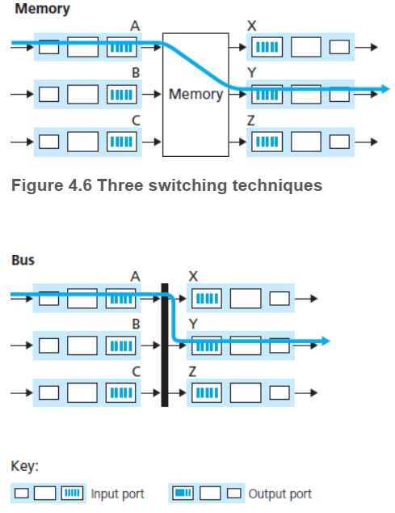
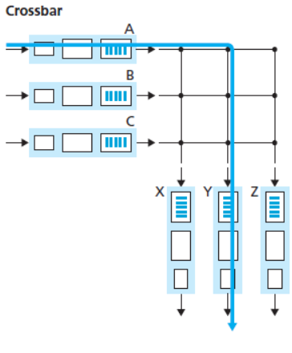
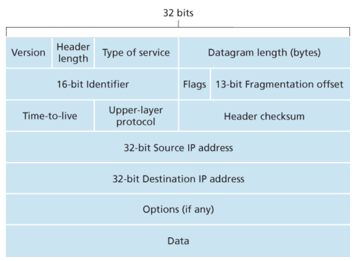
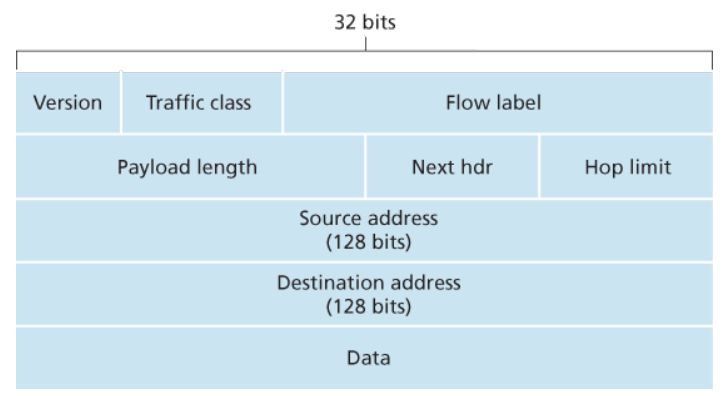

# 第4章 网络层：数据平面
网络层：分为两个互相作用的部分，数据平面和控制平面。前者决定网络中每台路由器的功能，即到达路由器的数据报如何转发到输出链路；后者确定网络范围，即控制数据报沿着源主机到目的主机的端到端路径中，路由器之间的路由方式。

## 网络层概述
简单来说，数据平面和控制平面分别对应网络层的转发和路由选择两个功能。  
转发：指将分组从一个输入链路接口转移到合适的输出链路接口的路由器本地动作。发生的时间尺度短，通常由硬件来实现。  
路由选择：指分组从源到目的地所采取的端到端路径的网络范围处理。通常时间更长，由软件实现。  
路由器中的转发表：检查到达分组的首部中的若干字段，在转发表中进行索引，来获取转发的目的输出链路接口。  
路由算法决定了插入路由器转发表的内容。传统上，路由选择算法运行在每台路由器中，并且每台路由器都包含转发和路由选择两种功能，并且包含与其他路由器通信的功能。另外也有 软件定义网络 SDN 方法，使用远程控制器来计算和分发转发表，即路由选择设备仅负责转发，而远程控制器计算并分发转发表，两者之间通过交换报文来通信。

## 路由器工作原理
数据报依次经过输入端口中的物理、链路和网络层模块，然后通过交换结构到达输出端口，再以相反的顺序经过三个模块发送出去。这些功能通常由硬件实现，因为要尽可能提高处理流水线的速度。另外用于控制平面的路由选择处理器则通常由软件实现。  
传统的路由器转发表使用目的地址前缀进行表项匹配，当有多个匹配时，使用最长前缀匹配规则。查找必须再纳秒级执行，所以在硬件查找的基础上，还需要设计简单且高效的搜索技术。  
交换结构是路由器的核心组件，通常有如下几种实现方式

在输入端口、输出端口和交换结构中均可能出现排队情况，当交换器内存用尽时，就会出现丢包。在有些时候，交换机会在缓存填满之前便丢弃一个分组（或在其首部加上标记），以此来向发送方提供一个拥塞信号。另外还有一些分组丢弃与标记的策略的研究，这部分策略被称为主动队列管理 AQM，一个被较广泛研究的例子是随机早期检测 RED 算法。

## 网际协议：IPv4, 寻址, IPv6 及其它
IPv4 数据报格式

注意到 IPv4 的首部可以包含可变数量的选项，所以需要一个首部长度 Header length 字段来确定载荷开始的位置。  
服务类型 Type of service 用以区分不同的 IP 数据报，比如对于实时流量和非实时流量的区分，是否对时延有要求等。  
标识、标志与片偏移与 IP 分片有关。不同的链路层协议能承载的最长网络层分组（最大传送单元 MTU）不同，进而限制了 IP 数据报的长度。更关键的问题是，发送方到目的地的每段路径上可能使用不同的链路层协议，故可能具有不同长度的 MTU。路由器在遇到输入的报文长度超过输出路径上的 MTU 限制时会将报文分片成更小的 IP 数据报发送出去。值得注意的是，为了保持网络路由器足够简洁和不影响效率，分片的组装在端系统上进行。这意味着目的主机收到一系列数据报时，需要确定这些报文是否涉及分片，并对相关报文进行组装。通常，发送主机会为同一个数据报的不同片设置同样的标识，除最后一片外的其它片标志为 1，最后一片的标志为 0，偏移字段则是让目的主机能正确地重新组装数据报，同时判断是否有数据缺失。若中间的路由器对某数据报进行分片时也遵循相同的规则。  
寿命 Time-to-live 字段与防止数据在网络中循环有关，每台路由器在处理时都会将这个字段减一，而当 TTL 字段减到 0 时路由器会丢弃该数据报。

在技术上，一个 IP 地址与一个接口相关联。接口是主机与物理链路之间的边界。  
IP 地址的分配并不是随意选择的。通常在同一个互联子网中的接口 IP 有着相同的前缀。使用子网掩码来标记 IP 中 32 个比特的前面多少找个比特用于指示子网。  
因特网使用的地址分配策略为无类别域间路由选择 CIDR。当寻址时，IP 地址被分为了两个部分，其中子网掩码用于标记第一部分的长度，这一部分被称为 IP 地址的网络部分（网络前缀）。一个组织通常被分配的是已快连续的地址（及具有相同前缀）。而剩余的部分通常用于区分组织的内部设备。  
当网络管理员向 ISP 申请地址后，就可以手动配置组织内各设备的 IP 地址。同时，对于主机的 IP 地址设置还可以使用动态主机配置协议 DHCP，允许主机连接进网络时自动地分配相关信息。  
DHCP 是一个客户 - 服务器协议。每个子网通常需要一台 DHCP 服务器，若没有则需要 DHCP 中继代理（通常是路由器）。DHCP 使用 4 个步骤来交换信息。首先是 DHCP 服务器发现，客户发送一个目的为 255.255.255.255 源为 0.0.0.0 的 DHCP 发送报文，通过 67 端口 UDP 发出，其中 255.255.255.255 是广播地址；然后 DHCP 服务器提供相关信息对客户做出反馈，发送一个 DHCP 提供报文，报文中包括发现报文的事务 ID、向客户推荐的 IP 地址、网络掩码以及 IP 地址租用期，同样使用广播地址发送；再接着是用户从可能的多个响应报文中选择一个，并发送 DHCP 请求报文；最后是服务器用 DHCP ACK 报文响应请求。另外还有机制用于用户更新其对 IP 地址的续租。

网络地址转换 NAT 能让家用或小型办公室这类的极小型网络以单个 IP 地址的单一设备的形式暴露给外部网络。使用 NAT 转换表，NAT 可以将两边的地址与端口进行翻译，然后再传输。

IPv6 的数据报格式

IPv6 将地址从 32 比特增加到 128 比特，除了单播和多播地址外还引入了任播地址（即允许将数据交付给主机中的任意一个）。首部字段被进一步简化，且为固定的 40 字节。不再允许分片和重新组装，而若路由器收到的 IPv6 报文过大时，只需向发送方返回一个分组太大的 ICMP 差错报文。IPv6 中还去掉了首部检验和。

## 通用转发与 SDN
将传统的转发进行扩展，允许协议栈的多个首部字段进行匹配，并执行相关的动作（转发到输出端口，重写首部值，负载均衡分组，阻挡或丢弃）。下面关于同于转发的讨论基于一个得到高度认可的标准 OpenFlow，其引入了关键的 SDN 抽象和功能。  
匹配和动作的转发表在 OpenFlow 中被称为流表，每个表项包括首部字段值集合（用于匹配进来的分组）、计数器集合（统计信息）和动作集合。这些字段允许使用通配符。
