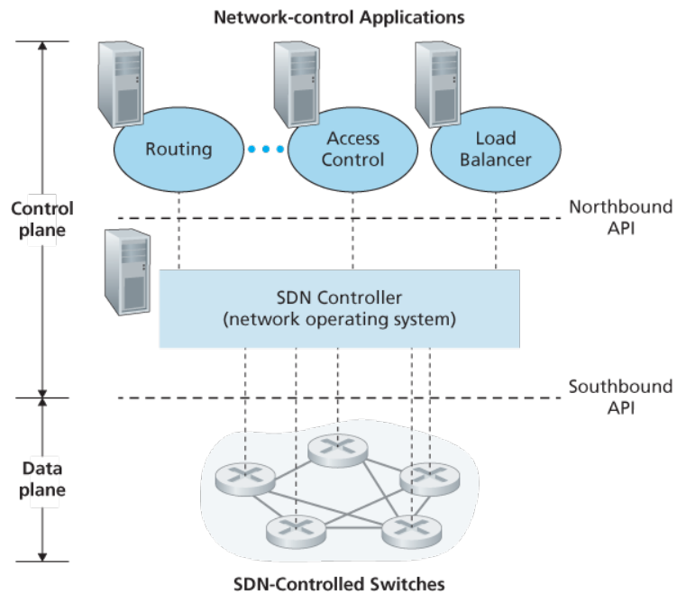

# 第5章 控制平面
控制平面是网络范围的逻辑，不仅控制从源主机到目的主机的端到端路径中，路由器如何转发数据报，而且控制网络层组件和服务如何配置和管理。

## 路由选择算法
根据算法是集中还是分散分为两种路由选择算法。前者用完整且全局性的网络知识计算最低开销路径，即要求节点在开始计算之前就已经知道所有节点之间的连通性和链路开销，也称链路状态 LS 算法；后者要求路由器以迭代、分布式的方式计算出最低开销，没有节点拥有关于网络链路的完整信息，其中比较常见的是距离向量 DV 算法。另外还可以根据算法是否支持网络结构动态地发生变化分为静态和动态算法。最后还可以根据是负载敏感还是负载迟钝进行划分。  
在 LS 算法中，网络拓补和链路开销的实践是，让每个节点向网络中所有其他节点广播链路状态的分组，其中分组中包含它自己所连接的链路的标识和开销，这通常由链路状态广播算法来完成。在这之后，所有的路由器就知晓了网络的整体情况，可以分别运行 LS 算法计算出所需的最低开销路径。  
链路震荡：即由于链路开销的设置问题（比如将链路开销与实时负载流量相关联），算法计算出来的路径在两个或多个方案上循环切换，造成拥塞和网络资源利用不匀。解决方法是确保路由器不在同一时间运行 LS 算法，或者让路由器即使以相同的周期运行算法但在每个节点上执行算法的时机不同，还有让每台路由器发送链路通告的时间随机化。  
距离向量 DV 算法更为复杂。它是分布式的（每个节点从邻居接收信息，执行计算，然后将结果分发），迭代的（该算法持续多轮直到邻居之间没有更多的信息需要交换），异步的（不要求所有节点以相同的步伐一致操作）。其基本思想基于最短路的 Bellman-Ford 方程。在每个节点维护一个到网络结构内其他节点的距离向量以及自己已知的到其邻居的开销，然后将其发送给邻居（同时从邻居接收），更新本地的，如果更新成功则继续向邻居发送新的距离向量。  
当出现链路开销变化（甚至链路故障时），通过信息传递，最终总能动态地调整成为正确的最优路径，但有时调整的轮数可能会非常大，可以采用毒性逆转的方式，故意通报很大的但错误的数据来让结果快速收敛，但这种方法的作用有限。

## 因特网中自洽系统内部的路由选择：OSPF
通过将路由器组织进自洽系统 AS 来解决规模增大和管理自洽的问题。一个自洽系统由其 AS 号唯一标识，在相同的 AS 中的路由器运行着相同的路由选择算法并拥有彼此的信息。  
开放最短路优先 OSPF 路由选择和与之相关的协议 IS-IS 被广泛运用于因特网的 AS 内部路由选择。其中开放指的是其路由选择协议规范是公众可用的。OSPF 是链路状态协议，每台路由器在本地运行 Dijkstra 最短路径算法，确定一个以自身为根的到所有子网的最短路径树。每条链路的开销由管理员配置。OSPF 向 AS 内其他所有路由器广播路由选择信息，当状态发生改变时就会发送，而若未发生变化也会周期性的进行广播。OSPF 报文由 IP 承担，其自己实现可靠报文传输、链路状态广播等功能。OSPF 使用密钥或 MD5 等手段进行安全鉴别，允许多条相同开销的路径同时承担流量，支持单播和多播等机制，支持在单个 AS 中的层次结构。

## ISP 之间的路由选择：BGP
当分组跨越多个 AS 进行路由时，就需要一个自洽系统间路由选择协议。在因特网中，所有的 AS 运行相同的 AS 间路由选择协议，即边界网关协议 BGP。BGP 是一种分布式和异步的协议。  
在 BGP 中，分组并不是路由到特定的地址，而是 CIDR 化的前缀。BGP 提供了从邻居 AS 获得前缀可到达信息和确定到达该前缀最好的路由的方法。  
在 BGP 中，没对路由器通过使用 179 端口的半永久 TCP 连接交换路由选择信息，发送的 BGP 报文称为 BGP 连接。其中，跨越两个 AS 的 BGP 连接称为外部 BGP（eBGP），其它的则为内部 BGP（iBGP）。值得注意的是，iBGP 连接并不总是与物理链路对应。  
当路由器通过 BGP 连接通告前缀时，会包含一些 BGP 属性（前缀及属性称为路由）。其中比较重要的两个是 AS-PATH 和 NEXT-HOP，前者包括了通告已经通过的 AS 的列表（检测和防止通告环路），后者则是 AS-PATH 起始的路由器接口的 IP 地址。  
热土豆选择算法：选择在自己 AS 内最近的转发出口。这一想法来源于，尽可能快地将分组送出自己所在地 AS（用可能地最低开销），而不管其 AS 外部到目的地地余下部分的开销。  
实践上，BGP 采用了结合热土豆算法特点的更为复杂的算法。按顺序使用下述规则直到只剩下一条路由：

1. 依照管理员配置的本地偏好。  
2. 选择具有最短 AS-PATH 的路由。  
3. 使用热土豆路由选择。  
4. 根据 BGP 标识来选择。

BGP 还常被用于实现 IP 任播（该服务常用于 DNS）。

## SDN 控制平面
SDN 体系结构具有 4 个关键特征：基于流的转发，数据平面与控制平面分离，网络控制功能位于数据平面交换机外部，可编程的网络。

SDN 控制平面大体分为两个部分：SDN 控制器和 SDN 网络控制应用程序。  
自底向上地，控制器需要提供这样一些功能层次：通信层（控制器与受控网络设备之间的通信），网络状态管理层（维护网络状态信息），与网络控制应用程序的接口。  
SDN 控制器是逻辑上集中的，可视为单一、整体的服务，但出于显示考虑通常采用分布式服务器集合来实现。

## ICMP：因特网控制报文协议
该协议被主机和路由器用来彼此沟通网络层的信息，最典型的用途是差错报告（如网络不可达）。位于 IP 协议之上。