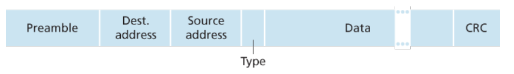

# 第6章 链路层和局域网
运行链路层协议的设备称为节点，包括主机、路由器、交换机和 WiFi 接入点；沿通信路径连接相邻节点的通信信道称为链路。  
链路层负责端到端路径上各段链路的传输。有两种类型的网络链路，点对点链路和广播链路。

链路层可能提供的服务有：成帧（将网络层数据报封装到链路层帧中），链路接入（媒体访问控制 MAC 协议规定帧在链路上传输的规则，比如多个节点共享单个广播链路），可靠交付（通常用于高差错率的链路，如无线链路），差错检测和纠正。  
链路层主体是在网络适配器（也称网络接口卡 NIC）中实现的。网络适配器核心是链路层控制器，通常是一个实现了许多链路层服务的专用芯片。链路层是网络协议栈中软件与硬件交接的地方。

## 差错检测与纠正技术
单奇偶校验：附加一个比特，使得所有比特中 1 个个数为偶数个。  
二维奇偶校验：将比特数据划分为二维矩阵形式，对于每一行每一列均设置一个检验位。能检测并纠正单个比特差错的情况（包括校验比特本身），能检测出任意两个比特差错的情况。  
检验和：将比特数据流看作一个一个 k 比特的整数，将这些整数加起来，用得到的和来作检验。  
循环冗余检测 CRC：发送方和接收方首先约定一个 r+1 比特的生成多项式 G（最高有效位为 1），对于 d 比特的数据 D，生成 r 个附加比特加在数据 D 后面，使得得到的 d+r 位比特能在模 2 算数下恰好被 G 整除。

## 多路访问链路和协议
当讨论广播链路时，就会遇到多个节点同时传输帧的多路访问问题，此时由于碰撞，没有一个接收节点能够有效地获得任何传输的帧。  
广播协议确保广播信道执行有用的工作，协调活跃节点的传输。理想情况下，一个速率为 R bps 的广播信道应该具有以下希望的特征：仅有一个节点发送数据时吞吐量为 R bps，有 M 个节点发送数据时每个节点吞吐量为 R/M bps（指平均时间），协议是分散的（不会由于某个主节点故障而使整个系统崩溃）。  
常见的多路访问协议能划分为 3 种类型：信道划分协议，随机接入协议和轮流协议。  
信道划分协议包括时分多路复用 TDM，频分多路服用 FDM 和码分多址 CMDA。这些方法都是将信道中的物理量分配给不同的信息交换对（时间帧，频段，编码），从而使得信息发送互不干扰。这样分配对于每一对都很公平，但是其发送的平均速率被限制住了。  
随机接入协议：传输节点以信道的全部速率 R bps 发送，若出现碰撞，则等待一个随机时延后重发，直到数据帧无碰撞地全部发送出去。  
轮流协议：其中一种是轮询协议，要求设置一个主节点，主节点轮流向每个节点告知能传输的帧的最多数量，然后等待其传输完后通知另外一个节点，但这一方法引入了轮询时延（通知一个节点“它可以传输”这一信息的时间），且高度依赖主节点的可靠性。另一种是令牌传递协议，令牌是一个小的特殊帧，在节点之间以某种固定次序交换，持有令牌的节点发送最大数目的帧数（如果有数据需要传输，否则立即转发令牌），但这一方法会由于一个节点的故障导致整个信道崩溃，或者节点忘记释放令牌，需要一些恢复机制来使令牌回到循环中。

## 交换局域网
链路层路由器使用链路层地址而不是 IP 地址来转发链路层帧。主机或者路由器的适配器（网络接口）具有链路层地址。值得注意的是，链路层交换机并不具备与接口相关联的链路层地址，因为链路层交换机仅负责在主机和路由器之间承载数据报，透明地执行该任务，故主机或路由器不必明确地将帧寻址到其间的交换机。  
链路层地址有多种称呼：LAN 地址，物理地址或 MAC 地址。MAC 地址被设计为永久的，但现在用软件改变一块适配器的 MAC 地址是可能的。没有两块适配器具有相同的地址，由 IEEE 管理这些 MAC 地址空间。MAC 地址是扁平结构的（与之对应，IP 地址是层次化的）。  
适配器在发送帧时，将目的适配器的 MAC 地址插入帧中，然后发送到局域网。一些交换机也可以将入帧广播到它所有的接口。接收端会比对帧中的 MAC 地址是否与自己匹配，如果是则向上传递给网络层，否则丢弃该帧。  
使用 MAC 广播地址 FF-FF-FF-FF-FF-FF 来让局域网上所有其他适配器接收并处理该帧。  
地址解析协议 ARP 用于在网络层地址和链路层地址之间转换。ARP 仅为在同一个子网的主机和路由器解析 IP 地址，其本身是一个在内存中保存映射关系的 ARP 表。当查询的映射在表中存在时，直接使用表中的数据，否则先发送一个用于广播查询子网内所有设备的 ARP 查询分组，得到回应后再发送。ARP 查询报文是在广播帧中发送的，其响应报文在标准帧中发送。ARP 分组封装在链路层帧中，是跨越链路层和网络层的协议。

### 以太网
以太网具有二进制指数回退的 CSMA/CD 多路访问协议。  
以太网帧结构如下

以太网的最大传输单元 MTU 是 1500 字节，最小长度是 46 字节（不足的部分需要填充，网络层会使用网络层首部中的长度字段自动去除填充部分）。值得注意的是前同步码，用于唤醒接受适配器，并将它们的时钟与发射方同步。

### 链路层交换机
交换机接收链路层帧并转发到正确的出链路，对于子网中的主机和路由器是透明的。  
交换机借助交换机表完成过滤和转发功能，典型的每个表项包含 MAC 地址、与该 MAC 地址对应的交换机接口和表项在表中放置的时间。  
对于一个从接口 x 到达交换机的帧：若地址没有响应表项，则广播该帧；若表项中将地址与 x 接口联系起来，则丢弃该帧；若表项中将地址与 y 联系起来（y $\neq$ x），则向 y 接口转发。  
交换机是自学习的。初始的时候其交换机列表为空，对于每个在接口介绍到的帧都自动地学习到其中的地址、接口和时间信息，且信息具有留存时间，超过时间且没更新的信息会被丢弃。交换机是即插即用的设备。  
交换机与集线器相比的优点是，保证绝不会在一个网段上同时间传输多于一个帧，且能够缓存帧数据，因此不会发生碰撞而浪费带宽。  
交换机支持异质的链路，由于链路彼此隔离，所以局域网中的不同链路可以运行在不同的媒介上，支持新旧设备混用。  
交换机也利于管理，并提供一定的安全性保证。

### 虚拟局域网
传统的使用物理设备构建的局域网有一下一些缺点：缺乏流量隔离（主要指携带 ARP 和 DHCP 报文的，或那些未被交换机学习到地址的帧），交换机的无效使用（硬件浪费），无法便捷地管理用户。这些问题可以用支持虚拟局域网 VLAN 的交换机来处理。  
这些交换机支持在单一的物理局域网上建立多个虚拟局域网。比如基于端口的 VLAN ，将端口由管理员配置为若干组，每个组构成一个 VLAN，形成一个广播域（来自该组中一个端口的广播流量仅能到达该组中的其他端口）。  
如果需要在不同的 VLAN 通信，可以将 VLAN 的一个端口与外部的路由器相连，并且将该端口配置为属于两个 VLAN。交换机厂商通常可以将 VLAN 交换机和路由器构造到一台单一设备上，以便于管理员配置。  
使用 VLAN 干线连接可以仅使用一个端口将两台设备的若干 VLAN 一一连接起来，这使用了一种扩展的以太网帧格式以区分属于不同 VLAN 的帧。

值得注意的是，VLAN 也可以基于 MAC，或者网络层协议，或其他准则来定义。VLAN 甚至可以跨越 IP 路由器扩展。
