# 第7章 无线网络与移动网络
在无线网络的讨论中包含一下一些一般性的元素：无线主机（类似有线网络中的端系统设备），无线链路（两个重要特性是覆盖区域和链路速率），基站（用于协调与之相连的多个无线主机的通信传输）。  
与基站相关联的主机被称为基础设置模式，而另外也有自组织网络不需要中心化的基站提供网络服务。  
通常根据两个准则来对无线网络分类：是否跨越了一个无线跳或多个无线跳，是否有基站这类基础设施。

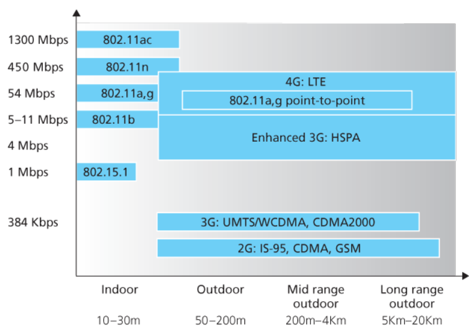

## 无线链路和网络特征
无线链路与有线链路相比有着许多重要的区别：路径损耗，递减的信号强度；来自同一频段的信号相互干扰；多径传播，主要指电磁波受物体和地面反射在发送方和接收方之间行走的路径长度不一，使接收方收到的信号模糊。  
信噪比 SNR：所受到的信号和噪声强度的相对测量，单位通常是分贝，是接收到的信号的振幅与噪声的振幅以 10 为底的对数的比值的 20 倍。较大的 SNR 能使接收方更容易从背景噪声中提取到传输的信号。  
比特差错率 BER：接收方收到的有错传输比特的概率。  

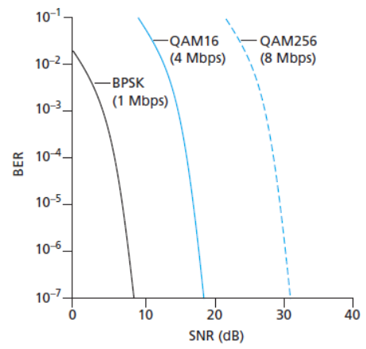

由上图可以得到一些简要的结论：给定调制方案，SNR 越高 BER 越低；给定 SNR，比特传输率更高的调制技术将具有更高的 BER；动态选择物理层调制技术能更好地适配信道条件，许多的无线通信规范都支持自适应的调制和编码。  
CDMA 码分多址技术在无线通信中应用很广泛。在该协议中，要发送的每个比特都要乘以一个信号编码比特来进行编码，且改信号的变化速率（码片速率）比初始比特序列的变化速率快得多。仔细地选择发送方的编码，就可以使得每个接收方能够从加性混合在一起的信号中分离出自己需要的部分。

## WiFi：802.11 无线 LAN
802.11 一族协议中包括若干个无线 LAN 的标准，整理表格如下。它们使用相同的媒体访问协议 CSMA/CA，使用结构相同的链路层帧，能够减少传输速率以延伸到更远的距离，支持向后兼容。值得注意的是，802.11 设备工作在两个不同的频率段上，其中 2.4GHz 频段是无需执照的频段，5GHz 频段的传输距离更短且更易受多径传播的影响。

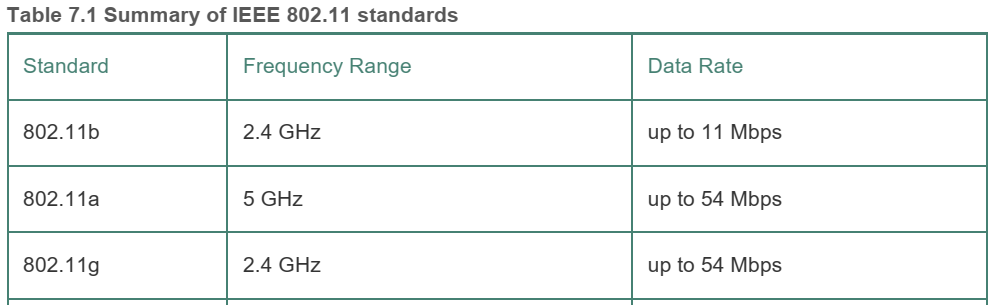

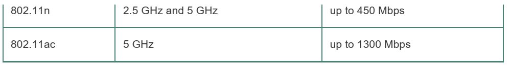

下图显示了 802.11 无线 LAN 体系结构的基本框架。其基本模块是基本服务集 BSS，每个 BSS 包含一个或多个无线站点和一个被称为接入点 AP 的中央基站。这其中的每一个无线站点和 AP 的无线接口都具有一个唯一的 6 字节 MAC 地址。802.11 同样也支持自组织的无线 LAN 。

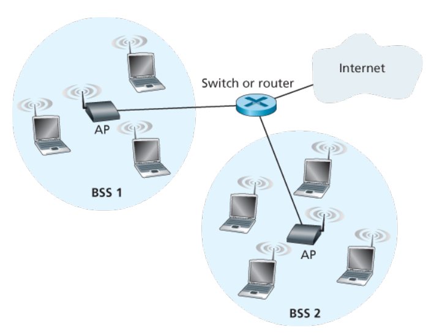

每个无线站点在发送或接收网络层数据前，必须与 AP 相关联。当管理员安装 AP 时，会给 AP 分配一个单字或者双字的服务集标识符 SSID，并分配信道号。802.11 在 2.4GHz 频段定义了 11 个部分重叠的信道，当且仅当两个信道由 4 个或更多的信道隔开时它们才无重叠。  
WiFi 丛林指的是从无线站点两个或多个 AP 都能收到很强的信号。无线站点需要从中选择一个建立关联。802.11 标准要求每个 AP 周期性的发送包含 SSID 和 MAC 地址的信标帧。无线主机通过信标帧了解到可用的 AP，然后从中选择一个，具体选择的算法由固件和无线主机的软件设计者决定（802.11 标准中无明确规定），一般的想法是选择具有最高信号强度的信标帧（但也有一些研究指出，信号强度不能是唯一的决定因素，有其它变量可能会干扰）。  
上述扫描信道和监听信标帧的方法被称为被动扫描，无线主机也能执行主动扫描，即向范围内的所有 AP 广播探测帧，AP 用探测响应帧应答，然后由无线主机选择一个 AP 关联。  
在选择好 AP 后，主机向 AP 发送一个关联请求帧，AP 以一个关联响应帧作为回复（注意对于主动扫描，这相当于二次请求/响应握手），然后主机通过 DHCP 协议加入 AP 所属的子网。  
无线主机可能还需要使用一些协议向 AP 鉴别它自身，常见的有 MAC 地址或用户名/口令的形式。一些管理员会选择将鉴别服务器与 AP 分离，以将多个 AP 的鉴别和决定集中到单一的服务器上。  
802.11 无线 LAN 协议使用的是随机访问协议，被称为带碰撞避免的 CSMA，简称 CSMA/CA。与在以太网中使用的协议的区别是：使用碰撞避免（而非碰撞检测），使用链路层确认/重传 ARQ 方案。  
802.11 未实现碰撞检测（因为要求站点同时能发送和接收，而在802.11适配器上，接收信号的强度往往远远小于发送信号的强度，用于检测碰撞的硬件代价较大；另外还有隐藏终端和衰减的问题）。这意味着，一旦站点开始发送一个帧，它就会完整的发送整个帧数据。  
802.11 的链路层确认：接收方接受到数据后，进行 CRC 校验，如果校验通过，则等待短帧间间隔 SIFS 的一小段时间，然后发回一个确认帧。若发送方在给定时间内未收到确认帧，则认为发送失败，进行重传，多次重传仍未得到确认则放弃发送并丢弃该帧。  
802.11 的 CSMA/CA 协议的简单流程如下：

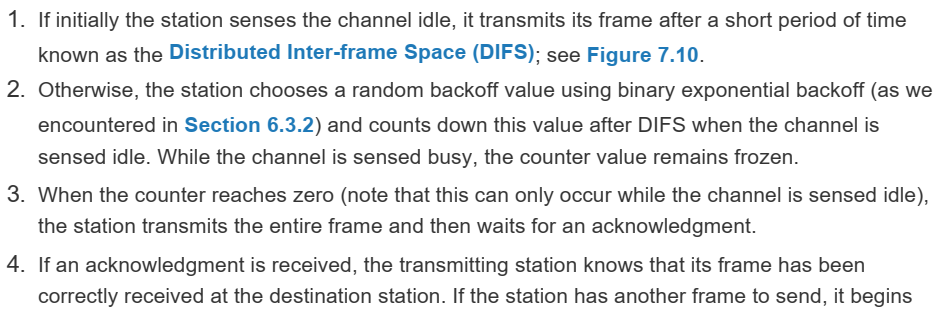

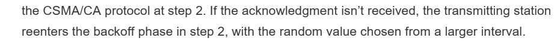

为了解决隐藏终端的问题，802.11 协议提供了一个短请求发送 RTS 控制帧和短允许发送 CTS 控制帧。当发送方要发送 DATA 帧时，先向 AP 发送一个 RTS 帧，指示传输 DATA 帧和确认 ACK 帧需要的总时间，然后 AP 广播一个 CTS 帧作为响应，明确发送方的发送许可并通知其它站点在该时间内暂停发送。这一方法引入了时延，故一般仅用于为长数据帧预留信道，在实际实践中，通常是设置一个门限值来判断是否启用 RTS/CTS 机制。

下图是 IEEE 802.11 的帧结构示意图。

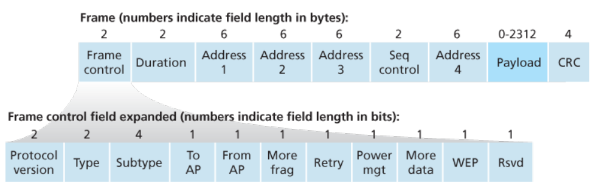

值得注意的是，这里有 3 个 MAC 地址，其中地址 1 和地址 2 分别对应接收和传输源的 MAC 地址，而地址 3 对应 AP 连接的路由器接口的 MAC 地址。这其中的原因是，AP 本质上是一个链路层设备，无法通过 IP 地址寻路，它对于路由器而言是类似透明的（即路由器认为自己是直接与设备相连的）。

802.11 协议中还包含速率适应和功率管理等高级特色。

## 蜂窝因特网接入
扩展蜂窝网络，使之在支持语音电话的基础上增加支持无线因特网接入。  
1G 系统是模拟 FDMA 系统，专门用于语音通信。  
2G 初始也是为语音而设计，但后来还扩展了数据（因特网）支持（2.5G）。在蜂窝的概念下，每个蜂窝网覆盖的区域被分为若干小区，每个小区内包含一个收发基站 BTS，负责在该小区内收发信号。一个小区的覆盖范围取决于许多因素，包括 BTS 的发射功率，用户设备的传输功率，障碍建筑物，基站天线的高度。2G 使用了组合的 FDM.TDM，将信道划分为若干子带且时间划分为若干时许。一个 GSM 网络中的基站控制器 BSC 通常可以服务几十个收发基站， BSC 的职责是为移动用户分配 BTS 无线信道，执行寻呼（找出用户所在的小区），以及移动用户的切换。另外还有移动交换中心 MSC 用于用户鉴别和账户管理。

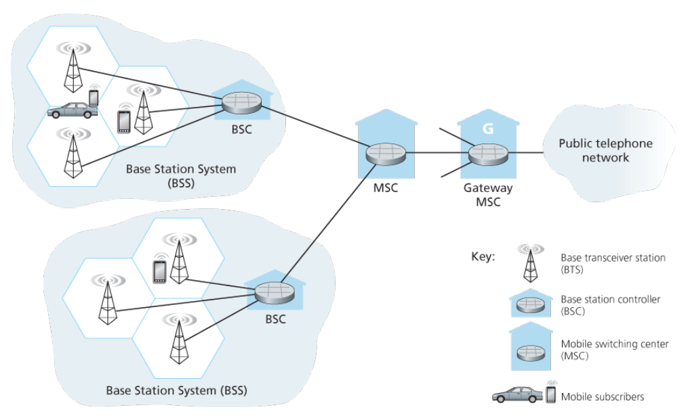

3G 蜂窝数据网将因特网扩展到蜂窝用户。其中 3G 核心网与蜂窝语音网中的组件协作，将无线电接入网连接到公共因特网。核心网主要包括两类节点：服务通用分组无线服务支持节点 SGSN 负责向接入的移动节点交付（或获取）数据报，并与 MSC 交互提供用户认证和切换，执行与 GGSN 之间的数据转发；网关 GPRS 支持节点 GGSN，将多个 SGSN 连接到更大的因特网，对外表现为一个普通的网络路由器，将 3G 节点的复杂结构隐藏。作为 3G 用户，看见的无线第一跳网络为 3G 无线电接入网，而无线电网络控制器 RNC 控制几个小区的收发基站（类似 2G 中的基站），RNC 同时通过 MSC 与语音网连接和通过 SGSN 与因特网连接，即 3G 蜂窝语音服务与数据服务虽然使用不同的核心网但贡献第一跳接入网。另外 3G 在 TDMA 诗序中使用直接序列宽带 CDMA。

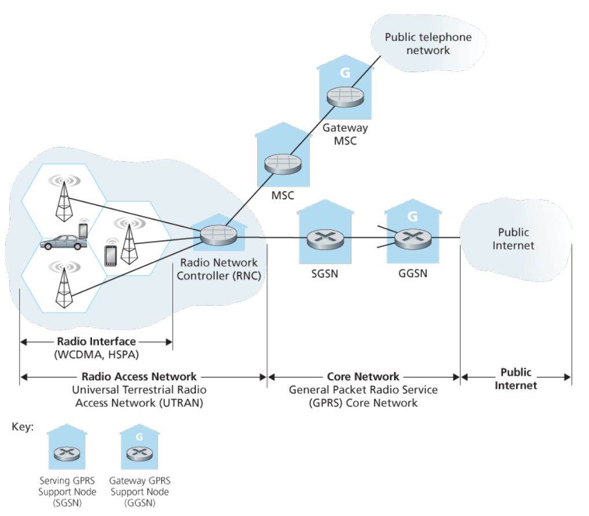

4G 相对 3G 有两个重要的创新：全 IP 核心网，加强的无线电接入网。在 4G 中，不再有分离的语音和数据核心网，所有的语音和数据都承载在 IP 数据报中。同时，4G 的数据平面和控制平面有着清晰的分离。其无线电接入网与全 IP 核心网之间也进行了分离。

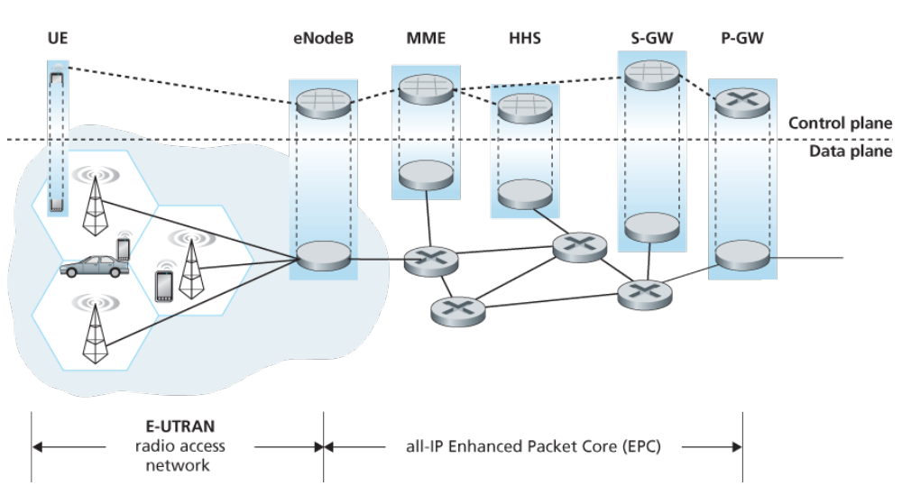

## 移动管理：原理
这里探讨的是保持移动节点的地址在移动的过程中始终保持不变，使得移动的过程对上层应用透明。  
移动节点的永久归属被称为归属网络，相应的其当前所在的网络被称为外部网络或被访网络，在两个网络中还有归属代理和外部代理用于管理移动功能。  
外部代理的作用之一是为移动节点创建一个转交地址 COA，与外部网络匹配。这意味着一个移动节点可以与两个地址相关联。外部代理告知归属代理，该移动节点在其网络内并拥有一个 COA。  
归属代理知道移动设备的 COA，然后需要通过一些方法将数据报转发过去，常见的有间接路由选择和直接路由选择。在间接路由选择中，通信者将数据报寻址到移动节点的固定位置，那么数据报会首先发送到归属网络，由归属代理通过 COA 转发到外部代理，然后再由外部代理转发给移动设备。直接路由选择引入了一个新的通信者代理，这一代理首先询                                                                                                                                                                                                                                                                                                                                                                                                                                                                                                                                                                                  问归属代理移动设备的 COA，然后直接与外部代理进行通信，使得通信时间减小，但增加了设备的复杂度。如果在连接之后出现了移动，则可以向归属代理更新信息，也可以将首次连接的外部代理作为本次连接的锚代理，之后的切换都通知改锚代理。
