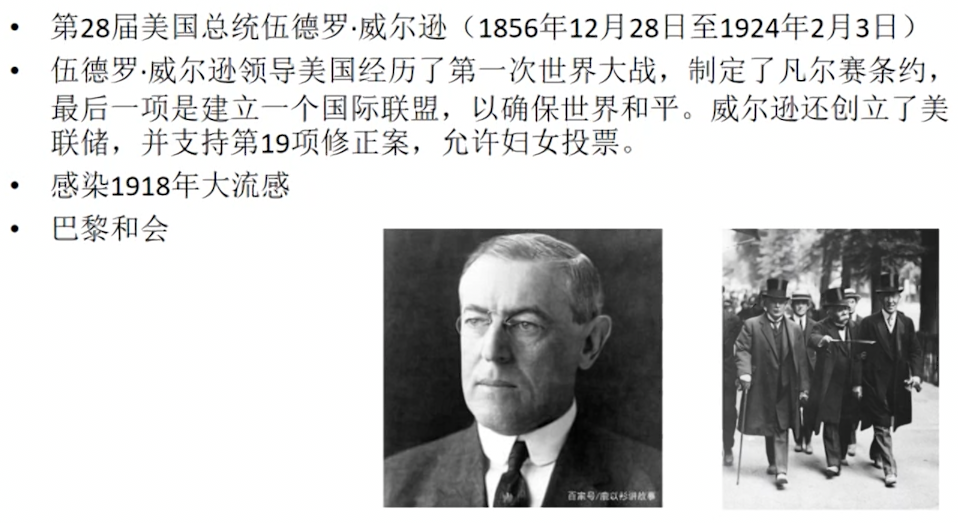
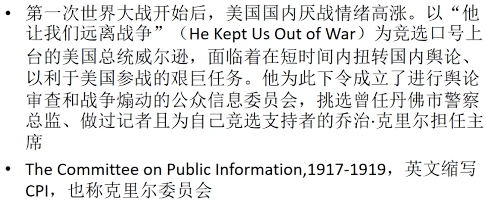
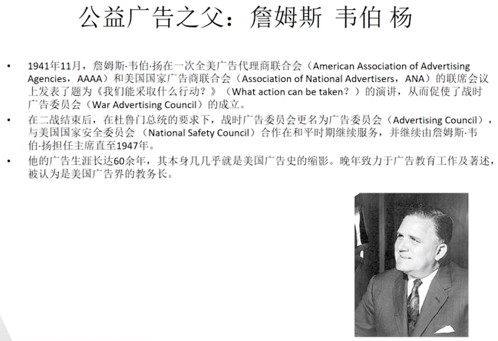
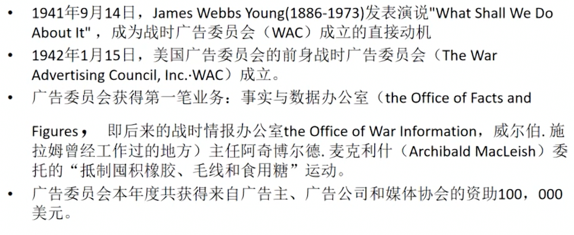
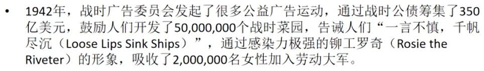
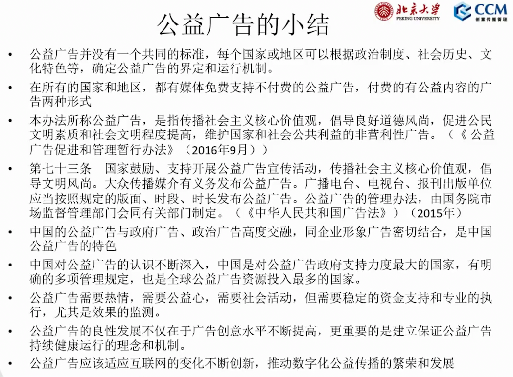

# 第 11 讲 广告类型-公益广告

## 公益广告
中国最早：1986 年，节约用水的公益广告。中央电视台，《广而告之》节目专门用于播出公益广告。  
在世界范围上，一般认为公益广告发源于二战时，美国的广告行业为反法西斯战争用于征兵和宣传等。但是更早也可以追溯到第一次世界大战期间。

通过舆论、宣传、广告以鼓动民众支持美国参加第一次世界大战。

公益广告：公共传播的特定形态，发布主体一般是公益性的组织机构，传递有益社会共同利益、推动社会发展的观念或诉求。

公益广告的形态  
各国公益广告的形态有非常大差异。这些差异并不存在对错，而是每个国家和地区对公益的理解，有公益广告的特定形态，这种形态同传播环境、政治制度、社会的特点有关。  
公益广告是非商业广告，但非商业广告不一定是公益广告  
政治广告：发布的主体是政党、特定组织或机构，传达其特有的理念，以赢得公众的理解和支持。主要形式是竞选广告。是非商业性的，但并非公益广告。  
政府广告：发布的主体是政府部门，用于推广自身的形象，围绕相关政策同民众的沟通。也不是公益广告。  
以上两种广告与普通的商业广告一样，按照相同的价格在宣传位上展出。  
公关广告：设法增进公众对组织的全面了解，提高组织的知名度和美誉度，从而赢得公众信任和何厝的广告。运用公关广告，可以起到塑造组织形象，强化品牌形象，宣传组织宗旨，引导公众观念等作用。这类广告一般是想媒体付费的商业广告的一种形式。内容可能是公益性的，但其目的一般仍然是商业性的。（在公益内容中出现广告的 logo）  
意见广告：由企业根据自身与社会公众交流的需要，从自身的品牌形象出发，选取相关性的主题，制作广告进行传播，表明对社会重要问题的态度，和其他广告最大的区别在于其涉及的话题和观点可能具有争议或引起社会讨论。这类广告一般是向媒体付费的商业广告的一种形式。  

在中国，公益广告主要是多种广告形态的杂糅：公益、政治、政府、公关和意见广告。  
在过去很长一段时间，中国的公益广告允许企业署名，但对时长、平面设计的大小占比有严格的要求。  
2016 年 公益广告促进和管理暂行办法：本办法所称的公益广告，是指传播社会主义核心价值观，倡导良好道德风尚，促进公民文明素养和社会文明程度提高，维护国家和社会公共利益的非营利性广告。  
公益广告是利用各类媒体或传播平台，进行有益于社会发展的理念、价值、情感或行为的传播、引导社会风尚、推动社会变革的广告类型。

公益广告的运行机制：在任何一个国家或地区，发展公益广告需要有一套社会体系来支持，而不是仅仅只依靠热情。

公益广告的数字化：从公益广告走向公益传播  
2021 年数据，公益广告数字化进程加速，中国领先。如在美国，目前分发公益广告的渠道仍然是电视、广播和户外广告三种为主，而在移动端分发和传播的比例仍然不足。

中国公益广告的数字化创新：  

* 传播主体创新：互联网企业主导下全民参与格局初现（如直播扶贫，电商扶贫，数字公益+社交裂变传播，腾讯公益等平台）  
* 传播技术创新：数字技术助力跨渠道整合传播（数字共享使得公益组织能够通过精准洞察促进复捐与粘性，同时数字平台正在将公益行业重塑为相互连接的公益数字化生态系统）  
* 传播内容创新：技术赋能创意，公民崛起促进内容多样化（内容是公益广告的载体，数字技术的发展不断促进公益广告传播内容的创新，创意平台为广告创意赋能，受众互动共创不断促进多样化的内容生成）  

数字化公益传播的特点：  

* 主体多元化  
* 传播个性化  
* 积极的有影响力的内容  
* 规模化、个性化、场景化、即时性的生产和发布  
* 传播效果与公益行动的协同  
* 品牌营销与公益内容的融合

