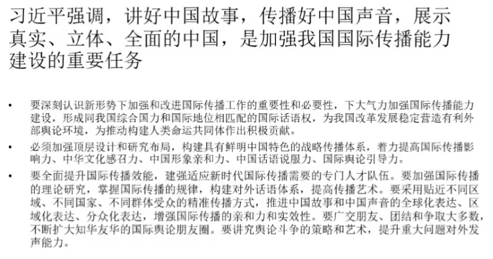

# 第 12,13 讲 广告类型-政府广告

发布主题是政府部门，用于推广自身的形象，围绕相关政策同民众的沟通，以及代表特定范围的民众利益通过竞争获得更多的资源；或者在全球环境中提升国家的影响力，争取更多的理解关注与支持。

由宣传到传播，不仅是一种态度和理念，更是一种传播技巧、执行方式和新的管理系统。  
在政府传播中，广告的运用是值得关注的变化  
政府传播肯定由自己独特的资源，但一定要根据传播规律，通过专业的执行，保证传播效果。还要适应行政自身的特点，通过协调的方式，力争使执行能够顺利和专业。  
政府广告主要包括两种类型：对内传播和对外传播  
政府传播同公益广告有交叉，对内传播一般同公益广告交叉，多为公共政策传播，比如税收、征兵等，也称为公共服务广告。  
越级和跨地域的对外传播使用媒体则表现为付费的政府广告。（政务信息，服务信息等各类公共信息以及专题宣传片等不属于本办法所称的公益广告，《公益广告促进和管理暂行办法》，2016） 

政府广告的类型：  

* 政府公益广告  
* 政策宣传广告  
* 政府招商广告  
* 政府旅游广告  
* 政府形象广告

国家形象：国家形象是国际社会公众对一国相对稳定的总体评价（张昆，《国家形象传播》）

国家品牌：21 世纪初，“东西方传播”公关咨询公司的 Thomas Cromwell 和 Savas Kyriacou 发表了《国家品牌和概念的收益》，首次提出了“国家品牌”概念。  
他们认为——无论是产品还是服务的质量、文化还是风景的吸引力，政治、经济还是外交，都可以通过国家品牌体现，国家品牌的塑造不仅能够帮助某一国家实现贸易、投资、旅游方面的目标，还能提升国家地位，影响主要大国的相关决策。

国家形象传播与广告：  
国家形象传播的方式是多元化的：国际新闻流动、娱乐媒体、外交活动、民间交流、公共关系、广告活动等。  
国家形象需要连续的国际间活动来建立，国家形象广告是塑造国家形象最直接、最有效的手段之一。  
广告是一种重要、直接、有效的国家形象传播模式。  

国家形象宣传片（国家形象广告）  
国家形象宣传片不同于以旅游推广为主的国家广告。国家形象宣传片的终点在传播国家理念。  
定义：以国家和政府机构为主体，借助本国或其他国家的媒体，传递国家理念、塑造国家品牌、宣传国家形象的一种广告形式。以国家为主体的旅游宣传广告是国家形象宣传的重要组成部分。

国家形象传播的重要性和必要性：  
国家形象是国家的软实力之一  
国家实体与国家形象同等重要，信息不对称情形下，形象更加重要  
国家形象是国家的无形资产，可以转化为有形的效益  
通过长期有意识的营销传播，最终把国家形象凝聚为稳定而有积极影响力的国家品牌  
优良的国家形象能提升国家居民的认同感和凝聚力  
一个不能表述自己的人，必然要被别人所表述，国家也不例外  
在全球竞争中，通过国家形象广告宣传等形式进行全球竞争和外交是常见的现象

国际传播中广告的作用：  
通过付费购买传播资源、或主动利用各类可拥有传播资源、自有传播资源等，依据明确策略，创意制作广告内容生产发布，进行专业化的海外交流、对话与沟通  
不需受记者的采访视角限制以及媒体的审核把关限制，只要符合当地的相关法律，就可以通过付费等方式购买和使用相关传播资源，在海外主流媒体以及各类平台，进行以我为主的主动表达。  
广告本应该是国际传播中的重要部分，但目前运用的并不普遍  
国家形象宣传广告和旅游广告是两种主要的类型  
利用互联网的国际广告交流发展迅猛  
国际传播中的广告交流应该重在专和精，发挥画龙点睛的作用