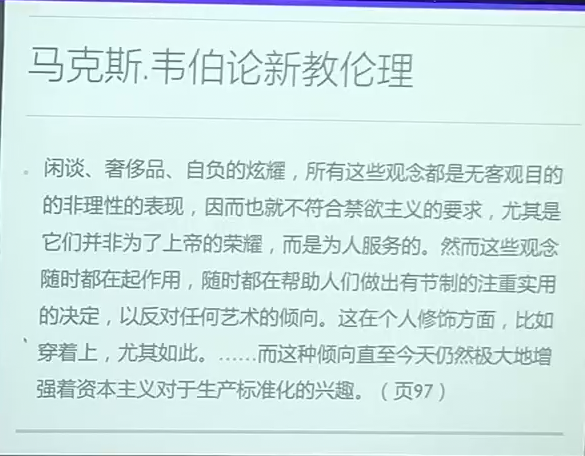
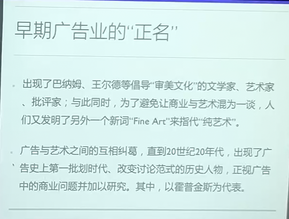
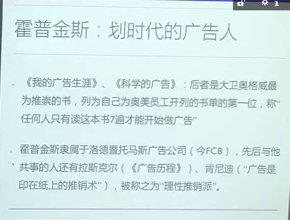
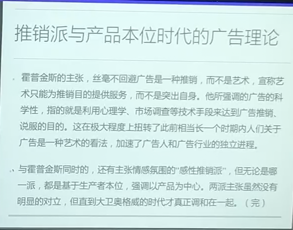

# 第 2 讲 新教伦理与现代广告业的起源

马克斯韦伯：新教伦理与资本主义精神

《丰裕的寓言》：现代广告诞生的三个矛盾

* 基督教本身有反对“贪恋”的教义，但的的确确是基督教（新教）的清教徒促成了资本的原始积累和物质生产的极大丰富（新教伦理与资本主义精神）  
* 新教伦理的一面是刻板、劳作与禁欲，另一面却是感性、自由与解放  
* 新教对于真实性、确定性的要求，使得人们对物质（商品）本身确定性的信任，以及对于商品贩卖手段的不信任；但广告又的确是诞生于新教世界中的。

问题意识：学术型的问题

## 第一个矛盾

基督教：从反对偶像崇拜到反对物质崇拜。  
基督教《旧约》中有反对拜偶像的教义。但反对拜偶像，起初并不是反对其他宗教，而是反对一种错误的信仰方式和信仰渠道。  
基督教会史上发生过多次的“圣像破坏运动”，并非针对其他异教的偶像崇拜，而是基督教内部位圣父子、圣母和圣徒塑像的行为，也是 11 世纪东西方教会最终分道扬镳的原因之一。  
最早只针对犹太人和基督徒内部，后来逐渐扩展到对异教徒拜偶像行为的抵制。  
文艺复兴时期，由一概反对偶像拓展到反对一切具象的物品（圣像绘画，圣像雕塑，走向人文主义绘画/建筑以及后来的抽象艺术）  
宗教改革时期，由反对具象事物，发展到反对一切对于物质的迷恋（《新教伦理》）

这本书中的新教主要指清教徒（英国，不遵从英国官方宗教改革的新教徒）

清教徒：清除旧礼仪（礼仪核心，建立神职人员的权威），禁欲主义。

新教伦理促成一种勤奋、忠诚、敬业的新教精神，视获取财富为确认自己是上帝选民的标志。正是这种精神促使资本主义发生在新教的美国而非天主教的欧洲国家、  
根源：基督教固有的财富观，以及宗教改革时期在清教徒中占主导思想的加尔文注意。预定论和天职观。一切合法的工作都是“天职”。

天职观：马丁路德宗教改革：唯独信仰，唯独圣经，唯独基督。反对神职人员的权威性，认为耶稣基督是唯一的“中保”。  
加尔文：一切合法工作都是天职（Calling，圣职），只要在自己的工作中积极、勤奋、服侍人，就是服饰上帝。而人类如果能够通过工作获得效果、得到报偿、积累财富，就是获得上帝的救恩、被上帝预选及拣选的标志。  
-> 资本的积累

解答：  
基督教排斥的是享乐，而非财富（反对纵欲，不反对性欲；反对酗酒，不反对饮酒；反对享乐，不反对物质财富的积累）。

美国经济发展和财富增长的原因：信仰的复兴，职业精神（由信仰复兴带来的）

## 第二个矛盾
李尔斯：人们与上帝合一的精神追求必然带来情感的兴奋（大奋兴，灵恩运动），浪漫主义而非禁欲主义，才符合人们对于一个理想的天堂的想象。

宗教的世俗化：宗教与商业结合，必然是宗教情感转向物质情感。宗教产业，宗教集团，宗教媒体，宗教广告，敬拜形式与现代表演的结合。  
唯美主义的兴起：提倡为艺术而艺术的同时，导向对于精致生活的追求。

法兰克福学派：  
阿多诺与启蒙的辩证法：物化的现实使得文化生产称为工业的流水线，艺术品失去光晕，“为艺术而艺术”（高雅）所倡导的正是它想遮蔽的反面（通俗）。  
启蒙的初衷是通过知识启蒙获得身体解放，但科学知识与工具理性却造成一种新的社会控制，人类处于物化的现实世界中而无法自拔。  
现代社会中人们的选择都是被预先设计好的，情感的表达与商业运作结合起来，审美的革命性已经丧失殆尽了。  
在今天，广告成了唯一的艺术品。

鲍德里亚论消费社会：  
消费社会：我们消费的不是商品，而是商品附加的文化意义。商品消费不是一种经济行为，而是自我对于某个社会集团或者某种意识形态表达价值认同的方式。  
商品的符号价值架空了商品的交换价值。  
商品的文化意义是更深层的社会结构的象征。唯美主义以反抗中产阶级为初衷，但最终无法逃离消费社会。

世博会现象。展示的不是商品，而是商品的表象。商品被展示的同时，其审美、符号的价值便架空了其使用的价值。  
取代了宗教意义上的朝圣活动，滋长了人们对于商品的崇拜心理。（商品拜物教）  
19世纪末广告业的兴起，也在极大程度上迎合了人们对于商品形象价值的追求。

## 第三个矛盾
李尔斯：新教对于真实性的要求加深了人们对于消费商品与贩卖手段的不信任感。  
有关图像真实性的讨论，反应了偶像崇拜和心理遗存。  
广告专业化：一方面，体现在广告自身的物化（巫术->一种物品，巫术的稳定化）；另一方面，加速了专业广告队伍的形成。

广告的职业化与专业化：广告的理性化（科学推销，心理学的研究，市场调查称为广告业的技术手段）。  
19世纪末，实证哲学兴起，宗教大复兴，广告业成为狂欢痕迹仅存的社会行为，一种新的巫术。广告商一方面接收了职业化的事实；另一方方面，广告商也加速了宗教的世俗化。

新教，文化，商业，艺术。  
广告的职业化->作家和画家有了施展自己才能的职业舞台  
相对于新教的不重外表、更重内涵的教义，商品与图像经过广告手段的联合，使外表和内涵连接成一个整体。  
广告模仿纯文学、纯艺术，开创专属于广告的新的艺术形式、艺术门类，提升广告的艺术价值和艺术品位。

早期广告业的“正名”

