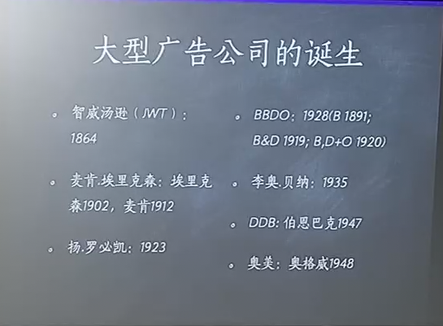
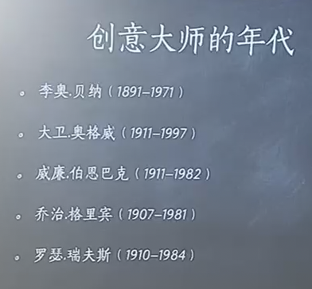
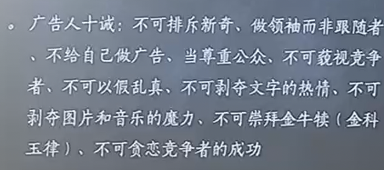

# 第 3 讲 广告大师与创意革命
——大卫奥格威、伯恩巴克、李奥贝纳

## 创意时代的来临

早期推销派广告理论：子弹论（“皮下注射论”，“魔弹论”传播->受众就会接收）——洛德托马斯公司（拉斯克尔，肯尼迪，霍普金斯《科学的广告》）  
关注焦点：生产者，产品自身特征（营销中的科学性）  
背景：卖方市场，广告业刚刚兴起  
理论支持：广告理论学，消费者心理学

50 年代发生了极大的变化。  
外因：战后生产力提高，物质资料极大丰富，市场从卖方市场向买方市场转移，销售产品取代了生产产品，成为企业关心的最大议题（产品供大于求）。广播电视普及，大众传媒极大发展，运用广告越来越多。  
内因：广告业自身发展完善，具备职业的独立性与专业价值，呼唤自身专业精神的建立。

中央电视台（北京电视台）：1950 年

### 创意
创意是广告特有的法则，是广告业对于人类文化最重要的贡献，也是广告业收到尊重的重要基础。  
以广告作为经济手段来说，创意是广告区别于其他推销工具的重要标志。  
以广告作为视觉表现来说，创意也是区分现代主义与后现代主义的重要标志。

> 关于创意思维的研究  
> 创意究竟是什么？  
> “旧元素，新组合”是否是创意的全部？  
> 创意是否是一种可以传授、可以习得的本领？  
> 创意在今天是如何传授？  
> 给创意一个概念本身违反概念  
> 没有套路、没有模式、没有方法  
> 困难  
> “灯笼”（纸里能包住火，推翻常规理解，让不可能的事物成为可能）

广告素养：识别虚假广告。潜移默化地塑造审美品味。  
设计塑造审美习惯（现代设计在很大程度上塑造了今天的审美规范和审美法则。量体裁衣-千篇一律）  
审美素养，设计素养

现代设计：形式追随功能。凡不是功能决定的装饰，一概都可以废弃。“装饰就是罪恶”。

### 詹姆斯韦伯扬 五阶段
收集资料：尽可能了解一切人类知识  
拼图游戏：头脑风暴，绞尽脑汁  
转换情景：完全放弃问题，转换心情  
灵感突发：创意会突然来临，随时准备好纸笔  
检验发展：从 idea 到应用，还需要一个过程

事后总结

## 创意大师
大型广告公司的诞生  
开始有创意部门。社会通过创意来认识广告公司。广告公司回避自己作为代理的身份，而是突出创意。  
突出广告人，以人名命名。

## 科学派——大卫·奥格威
奥美（38岁创建，1948 年）  
1911 年出生于伦敦乡下，曾入牛津大学，但因成绩太差而退学。  
在法国担任厨师，后回到英国担任炊具推销员。后去美国担任推销员，后去美国，加盟盖洛普调查公司。二战期间担任间谍。  
1948 年，38 岁的奥格威创办奥美，晚年居法国。  
一生从未到过中国，但在中国有大量信徒。  
曾是调查员，明白调查的好处。反对艺术家。  
创意基于调查，而不是根据艺术家的手段做创意。  
1997 年去世。

### 霍普金斯：划时代的广告人
《我的广告生涯》，《科学的广告》。后者是大卫奥格威最为推崇的书，列为自己奥美员工开列的书单的第一位，称“任何人只有读这本书 7 遍才能开始做广告”。  
霍普金斯隶属于洛德托马斯公司（今 FCB ），先后与他共事的还有拉斯克尔（《广告历程》），肯尼迪（“广告是印在纸上的推销术”），被称为“理性推销派”。

#### 广告都是推销术

* 早期推销——推销产品（产品中心，如预先占用权，USP）  
* 中期推销——推销创意（广告人中心，如三大创意棋手）  
* 后期创意——推销价值（消费者中心，如定位）  
* 晚期创意——推销关系（利益关系人中心，如 IMC）

#### 人都是自私的

除非对自己有利的事情，否则消费者不会去做。  
经济学：理性人假设。  
广告的心理学研究：早期心理学的主要支流。  
小规模的市场调查：小规模样本、抽样技术的进展。

#### 反对否定式广告
广告应该宣传自己的优点，而不是贬低别人的缺点。  
“表现被嫉妒的人，而不是嫉妒的人”  
以正面、积极的产品宣传反对否定式广告。

#### 预先占用权
人人皆有、无中生有的卖点  
如：真空清洗过的啤酒瓶、沃尔沃  
区别于 USP ：独一无二的销售主张，商品的特殊性。

#### 推销派与产品本位时代的广告理论（霍普金斯）
霍普金斯的主张，丝毫不回避广告是一种推销，而不是艺术，宣称艺术只能为推销目的提供服务，而不是突出自身。  
强调广告的科学性，指的就是利用心理学、市场调查等技术手段来达到广告营销、说服的目的，这在极大程度上扭转了此前相当长一段时间内人们关于广告是一种艺术的看法，加速了广告人和广告行业的独立进程。  
与霍普金斯同时的，还有主张情感氛围的“感性推销派”，但无论是那一派，都是基于生产者本位，强调以产品为中心。两派的主张虽然没有明显的对立，但到大卫奥格威的时代才真正调和在一起。

### 广告是科学而非艺术
广告是卖商品，否则就不是做广告  
广告的内容比表现内容的手段更重要  
反对包豪斯系统及纽约美术指导俱乐部  
重视调查研究：“我们用 5 种调查方法来找出什么是最有分量的承诺”

### 创意哲学
若你的广告基础不是上乘的创意，它就必遭失败。  
创意的核心是找到正确而有效承诺的科学方法和技巧，而不是想当然。  
我对什么事物都能构成好的文案构想，几乎全部都从调查研究得来，而不是个人的主见。  
千万不要写连你家人都不爱看的广告。

### 品牌形象理论的提出
霍普金斯：个性化。  
绝大多数厂商接受不了它们的产品形象有一定的局限性，希望对人人都适用。  
致力于在广告上树立突出性格品牌形象的厂商，会在市场上获得较大的占有率和利润。  
没一则广告，都应该被看作是对品牌形象这种复杂的现象在作贡献。  
任何设计都不能使得所有人满意。只能定位于某一特定群体。

### 奥格威的局限性
理论更多是经验的总结，在概念界定和逻辑性方面，与学术意义上的理论大异其趣，如“科学”。  
处于时代局限或个人局限，奥格威的很多理论缺乏严格的论证与检验（如阴式文案）。  
内在充满矛盾性：科学派的创意棋手称为具有艺术气质的广告“大师”。  
属于经典广告理论时代的集大成者，即使今天再世，也无法回应新媒体时代广告业所面临的一切问题。

## 艺术派——伯恩巴克
DDB（1947年）  
出生于纽约，毕业于纽约大学英文系，在写作上展露才华。  
曾任 Grey 创意总监，1947 年离职创立 DDB。  
强调广告艺术性与创意的重要性，率先成立创意小组，取代了文案与美术指导各行其是的做法（以前，广告文案->美术设计，两个流程，缺乏沟通）。  
坚持不做烟草广告，奥格威称其为“有智慧的绅士”。

### 广告是说服的艺术
规则正是艺术家想要突破的东西，值得记忆的东西从来不是从方程式中得来的。  
并不是你的广告说的是什么感动了观众，而是你采用什么方法说。  
忘却于永存的区别在于艺术技巧。  
广告人若能洞察人性，以艺术的手法去感动人，他就能成功。

### 反对“广告是一种科学”
广告最重要的东西是独创性和新奇性，85% 的广告是根本没有人看的。  
广告界既不被美国人所喜爱，也不为美国人所怨恨，因为他们完全忽视了我们。  
我们对于商品的了解远远赶不上客户，但我们对于广告的了解同他们对于商品的了解一样多。  
他们自以为是广告科学家，但不幸的是，广告本来就是劝说，而劝说根本不能成为纯科学，它就是艺术。

### ROI 理论
ROI 理论（relevance 相关性，originality 原创性，impact 冲击力）

* Relevance 相关性：广告不是为创意而创意，而是为宣传产品而创意，想象要从产品中产生。  
* Originality 原创性：勇破常规，与众不同。  
* Impact 冲击力：要在消费者脑海里留下不可磨灭的记忆，要让观众在一瞬间发出惊叹，立即明白商品的优点，而且永不忘记——这就是创意的作用。

## 芝加哥学派——李奥贝纳
出生于密歇根，毕业于密歇根大学新闻学院，大学期间曾在广告公司兼职工作，大学毕业后成为芝加哥附近一家日报社的记者。  
后入底特律凯迪拉克汽车公司，任公司内部刊物编辑。之后来到芝加哥，正式进入广告业。  
1935 年 47 岁，成立以自己名字注册的广告公司。80 岁去世时是世界上最大的广告公司。

### 与生俱来的戏剧性
产品即英雄：一件商品只要存在，就必然有其独特性。广告人的工作就是去寻找这种独特性。  
做广告最伟大的成就，就是使人信服：没有任何东西能比产品本身更能说服人。  
广告中原创的诀窍不在于那些花哨的文字，而在于组合那些熟悉的文字于图像，产生全新的趣味。  
广告无法为人们不需要的产品创造奇迹，但可以将产品原先被忽视的特点表现出来，激起人们拥有的欲望。

可能受到哲学中现象学的影响，本质之观。

### 广告人的禁忌
广告三忌：自我标榜，夸大其词，舞文弄墨。

经典代表：万宝路香烟

## 经典广告理论的终结
60 年代：争取消费者注意力的竞争一年比一年激烈，但广告理论的发展并没有偏离“功能主义”。  
三大创意棋手与 20 年代的“推销派”一脉相承：都是从产品功能出发探求广告的有效诉求，其最集中的表现，就是 40 年代代瑞夫斯提出的 USP  
但当经典广告理论发展到最高阶段后，必然要经历一种转型，那就是从功能主义理论走向品牌形象论。
