# 第 4 讲 从品牌定位到整合营销传播
二十世纪末营销理论的再审视

二十世纪的广告：现代广告的诞生。

从推销派到创意革命：  
20世纪20-40年代（推销派），生产者本位的广告理论。以产品特征为中心，肯尼迪“纸上推销术”，霍普金斯“预先占用权”，里夫斯“USP 独一无二的卖点/销售主张”。还可分为理性推销派（洛德托马斯公司三杰）和感性推销派（注重情感诉求）  
20世纪50-60年代（创意革命），广告人本位的广告理论。创意革命，产品极大丰富导致产品特征不明确，广告创意成为产品的卖点（三大广告创意旗手，广告名人堂五杰）。  

从定位到整合营销传播（IMC）：  
20世纪70年代：消费者本位的广告理论。以消费者为中心，标志是定位理论的提出。传统广告的最后一次绝响（2001 年美国营销协会举办的 20 世纪营销理论评选，定位超过 USP 和 IMC 成为有史以来对美国影响最大的营销理论）。  
20世纪90年代：利益关系人本位的广告理论。以利益相关者为中心，标志是整合营销传播理论的提出。广告被营销传播所取代。

## 定位
艾尔·里斯 与 杰·特劳特（理论先行）  
60 年代发表文章《定位是人们在今日模仿主义市场中所玩的竞赛》  
70 年代，在《广告时代》发表一系列文章，提出“创意的时代已经一去不复返，现在麦迪逊大街的新名词是定位”  
1981 年，出版《广告攻心战略——品牌定位》  
1996 年，特劳特与他人出版《新定位》  
2002 年，里斯与其女儿出版《公关第一，广告第二》

### 定位理论提出的社会环境与学术背景
70 年代，美国经济进入萧条期，严重的经济衰退和通货膨胀导致生产成本大幅攀升，广告收入骤降。60 年代以创意为中心的广告革命迅速降温，取而代之的是经济务实、突出销售、有的放矢的广告传播宣传。  
50 年代，营销学理论成熟，主张企业的一切活动以满足消费者的需求为前提。60 年代，传播学理论从“传者本位”向“受者本位”转移。  
广告学自身，在 50-60 年代的创意革命中，也已经初步提出了品牌的问题，并将品牌作为广告学的核心命题之一。

### 三个核心命题
消费者的心灵是营销的终极战场，是消费者在定位产品，而不是广告主和广告代理商。  
广告进入消费者心智的前提，是符合消费者的认知结构。  
广告的功能，就是在消费者心目中设立难以模仿的差异化特征。  
其中最重要的是第一条和第三条（目标消费者心智、差异化传播）

### 从产品到消费者
定位要从一个产品开始。产品可能是商品、服务、机构甚至是人，定位不是你对产品要做的事，而是你对预期客户要做的事。即，要在预期客户的头脑里给产品定位。  
定位并不是不包含变化在内。不过只是名称上的变化，产品的价格和包装事实上都丝毫未变。变化基本上是表面的，旨在确保产品在预期客户头脑里占据一个真正有价值的地位。  
“非可乐”  

例子：

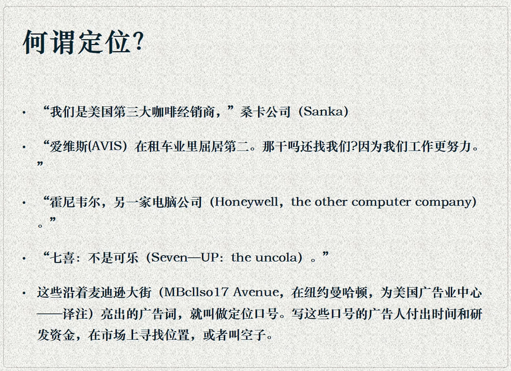

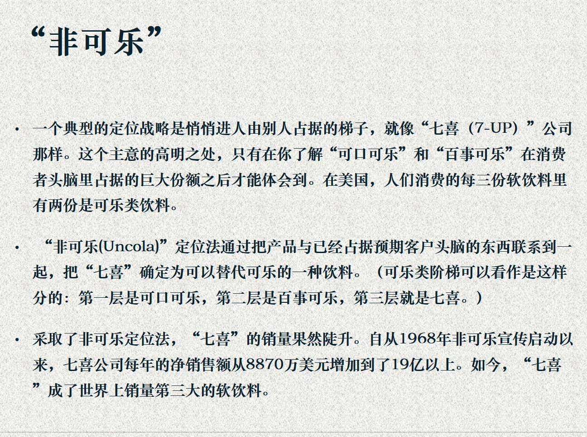

### 定位理论的前后左右
USP：定位理论的源头。挖掘产品中的特质，凸显区别于其它产品的特点。但是单纯从功能出发，没有把消费者的情感和心理考虑在内。  
品牌形象理论：定位理论的探索。产品的同质化要求产品必须具有自己的形象、性格或个性。但仍然是从广告人的直觉和想象出发，而不一定是消费者所需要的。  
品牌个性理论：定位理论的深化。在消费者心目中塑造产品独特的个性造成亲切感。  
CI 理论：定位理论的横向扩展。使产品个性的差异拓展到企业差异层面，从产品、品牌定位走向企业形象定位。  
整合营销传播：高扬了定位理论消费者至上的大旗。

### 定位理论的意义与局限
它使得广告理论从广告本身，拓展到了营销本体的层面。广告/营销不再是一个名词，而是一个动词。  
从广告到窄告，从生产者到消费者，从功能主义发展到情感主义，与 20 世纪产品设计的趋势一脉相承。  
只是一种推销策略，而没有对产品自身作出任何的改善。占据大脑不等于占据市场，品牌印记不等于品牌偏好。更何况，有很多占据大脑的广告，损害的是整个广告行业的社会公信力。  
乔治路易斯：“定位是个屁”

## 整合营销 IMC
1992 年《整合营销传播》：提出把广告、促销、公关、直销、CI、包装、新闻等一切传播活动都涵盖到营销范围内，使企业能够将统一的新闻资讯传达给消费者  
作者：美国西北大学教授唐·舒尔茨及其合作者斯坦利·田纳本、罗伯特·劳特朋。  
西北大学广告：新闻学院派（和业界互动的文章，与实现更加紧密）和管理学院派（实证研究，定量，教材）  
科罗拉多大学教授汤姆·邓肯和莫里亚历引入概念“关系利益人”：整合营销传播指企业或品牌通过发展和协调战略传播活动，是自己借助各种媒介或其他接触方式与员工、顾客、投资者、普通公众等利益关系人建立建设性的关系，从而建立和加强他们之间的互利关系的过程。

消解广告的概念，将企业的营销和传播活动合而为一，营销就是传播。市场营销关注的重心不再是广告。  
提出“利益关系人”的概念，整合了此前广告理论中的生产者、广告人、消费者等核心要素，甚至加入竞争者、员工在内的和营销有利害关系的所有人。广告关注的重心不再是哪一类人。  
营销传播的一元化策略：用一个声音说话。  

### 什么是营销
市场营销：就是在适当的地方，适当的时间以适当的价格，适当的信息沟通和促销手段，向适当的消费者提供适当的产品和服务。  
营销的客体包括商品、劳务或概念。营销的范围一直在扩大：企业、非营利事业、个人都需要营销。  
营销是一个过程，从创意的产生到顾客的满足。营销是整合的活动，目标不同，组合各要素的比重不同。营销的最终目的是满足目标市场的需求。  
营销的理论只适合市场经济。

### 传统营销的要素 4P
* 产品 product：能提供给市场以硬气人们注意、获得、使用或消费，从而满足某种欲望或需要的一切东西。产品观念认为，消费者最喜欢高质量、多功能和具有某些特色的产品，在产品导向型组织里，管理着总是致力于生产优质产品，并不断地改进产品，使之日臻完善。  
* 价格 price：消费者喜爱那些价格低廉的产品。  
* 通路 place：是促使产品或服务顺利地被使用或消费的一整套相互依存的组织。渠道观念认为，消费者喜爱那些可以随处得到的产品，生产导向型组织的管理当局总是致力于获得高生产效率和广泛的销售覆盖面。  
* 推广 promotion：狭义的定义是促销，广义的定义是包含促销在内的所有销售活动。推销观念认为，如果听其自然的话，雄安飞着通常不会购买某一组织的产品。因此，该组织必须积极推销和进行大量促销活动。  

### 广告在营销中的位置
产品要素：产品线、品牌、包装、服务、品质等  
价格构成：基本价格、折扣、信用条件、付款方式、价格政策、价格策略  
通路组合：物流、通路形态、立地条件、销售区域、仓储运输  
推广组合：广告、促销、人员销售、公共关系

### IMC 的前提：4C 取代 4P
product 产品 - consumer 顾客  
price 价格 - cost 成本  
promotion 促销 - communication 传播  
place 渠道 - convenience 便利

消费者请注意 - 请注意消费者

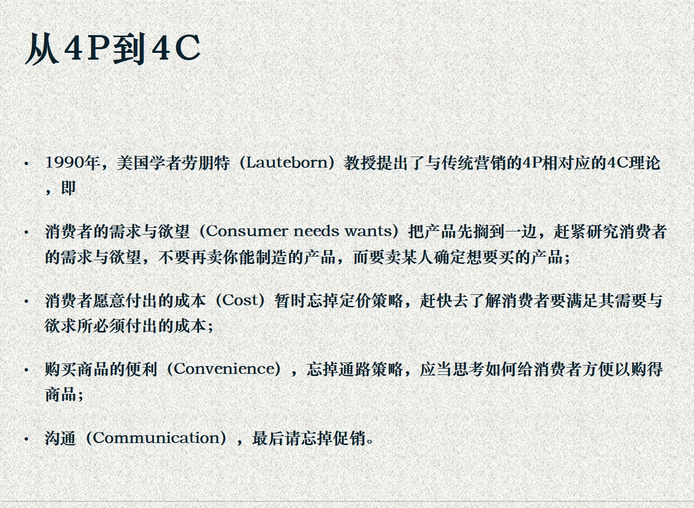

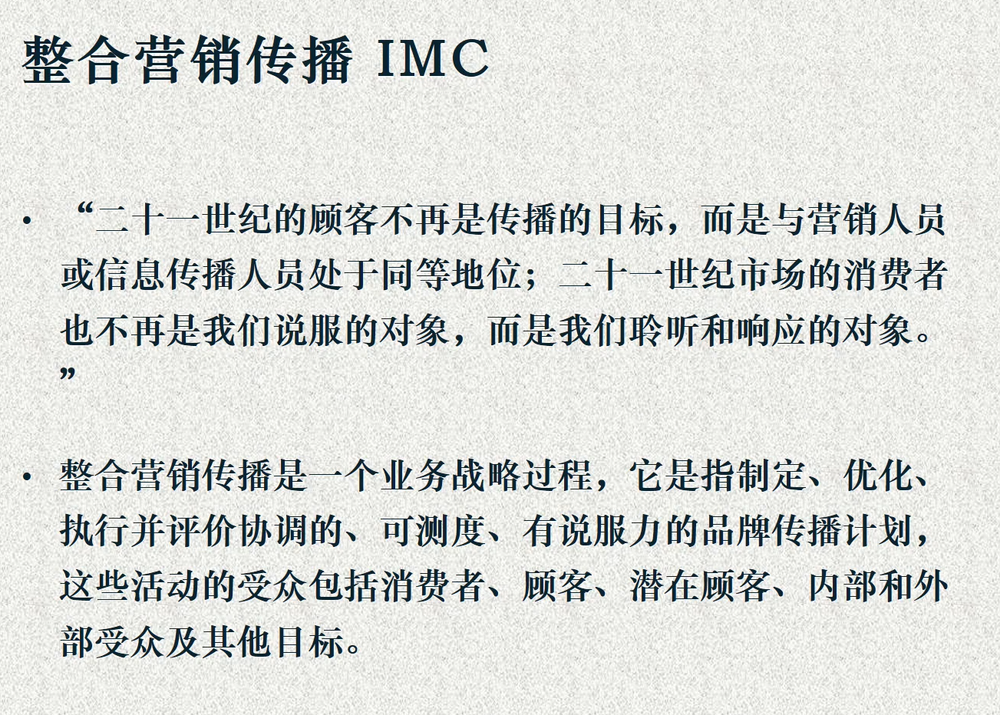

### 一种形象，一个声音
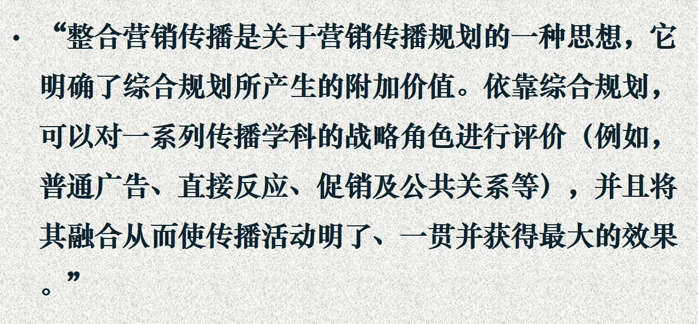

### 品牌讯息的四种来源
计划内讯息：计划内讯息应该朝着预定的传播目标努力，这是整合营销传播最根本的方面。  
产品讯息：产品讯息必须与广告承诺一致。  
服务讯息：服务讯息比计划内讯息具有更大的影响力。  
计划外讯息：员工的闲话、小道消息、贸易圈的评论、口传谣言或重大灾害引起的企业所无法控制的讯息。

### 关系营销与整合营销传播
整合营销传播是关系营销得以实现的保障。企业或品牌通过发展和协调战略传播活动，使自己借助各种媒介或其它接触方式与员工、顾客、利益相关者以及普通公众建立建设性的关系，从而建立和加强他们之间的互利关系的过程。  
顾客会自动把企业或其他信息源发出的与产品有关的讯息整合在一起，它们整合这些讯息的方式会影响到它们对企业的感觉。整合营销传播的关键在于管理、控制和影响消费者的感觉。

### 精准传播（数据库）
以信息科技为基础，用来搜集关于现有客户与潜在客户的各种资料（姓名、地址、电话，偏好、兴趣、购买行为、生活形态、促销反应、人口统计等）  
目的在于了解顾客的需求，讲客户需要的商品提供给他，并且预告下次可能购买的商品与时间间隔，以便与客户进行长久的教义。  
资料库中的客户信息要变动更新，以确保其有效性。

### 强力执行（传播集团）
完成整合营销传播的任务需要成熟的整合营销传播机构的配合。  
欧美日等国家和地区的广告业已经完成了这个调整。咨询、广告、公关、直销行业、市场研究、促销、活动营销等行业在充分专业化后，又进行并购和整合，以适应市场的变化。  
中国这些行业发展并不整齐。除广告业之外，很多行业还处于才起步的状态，比如公关业，尚需要解决专业化和本土化的问题。从这个角度来看，是否有足够多的成熟的整合营销传播机构来配合执行，是整合营销传播在中国发展的难题。

点子公司

### 评论
与早期广告人提出的广告、营销理论不同，IMC 又理论家、学者提出，而非从业界具体实践中产生。他们虽然也有在业界工作的经验，但是所在公司及业绩并不十分显赫。 IMC 是通过总结和观察当下市场的特点和发展趋势得出的逻辑结论，在提出的时候具有前瞻性，但还是缺乏相关的案例支撑，如何应用于大规模的市场实践还需要一个落地的操作过程。  
本质上仍然是营销理论，虽然整合了传播的手段和要素，但是对于传播学理论自身借鉴不多，贡献也不大。  
和以往的广告营销理论类似， IMC 是一个普适的理论，并没有针对各行各业的特殊性给出具体的解答；同时，基于美国的传播环境和市场背景而提出，在中国有庸俗化的嫌疑。  
舒尔茨“最大的遗憾就是没有早一点来中国”  
面对市场环境、媒介环境的巨变，当下广告业正处于迷茫期，一些传统的模式行将终结，而新的模式又常常是以消解“广告”本体为代价的。

## 广告之变
广告史：终结还是转变？  
古今：从古典广告到现代广告（代理制）  
未来：从现代广告到营销传播  
在技术如火如荼地发展的当下，广告及其教育者必须经历脱胎换骨的凤凰涅槃，重构自己的知识结构和专业技术，才能够适应这种挑战。  
互联网

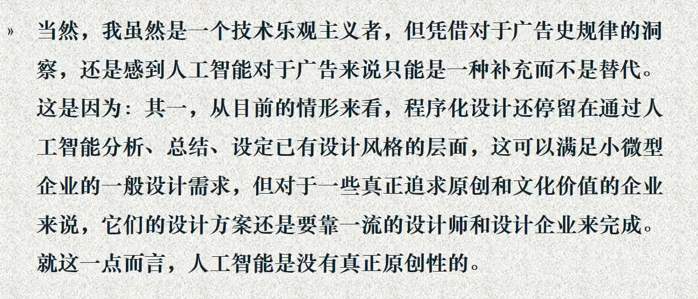

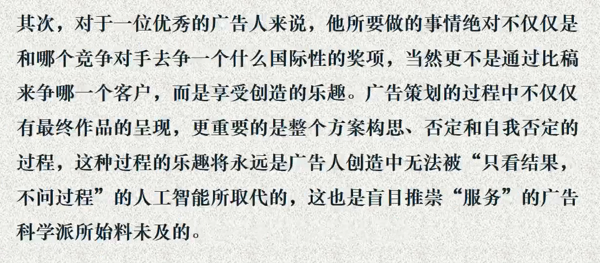

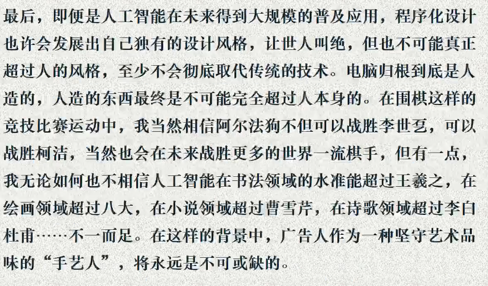

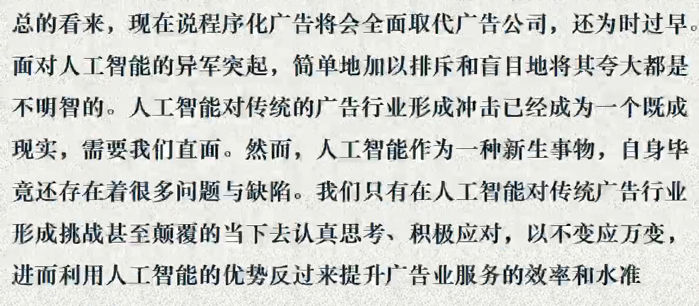

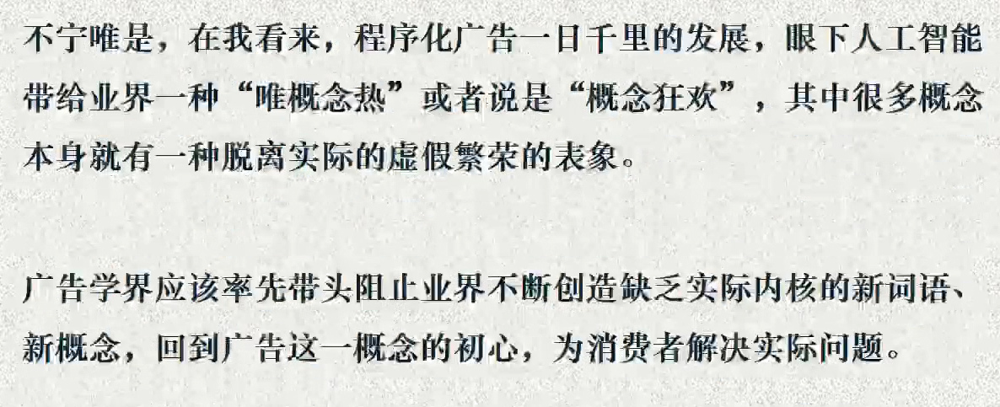

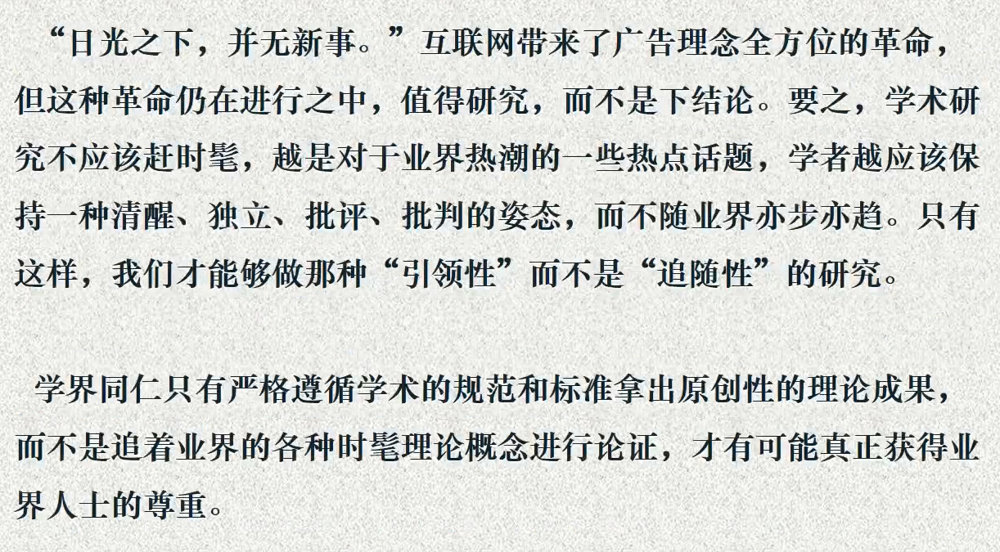
