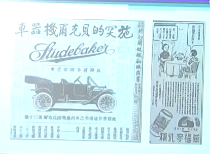
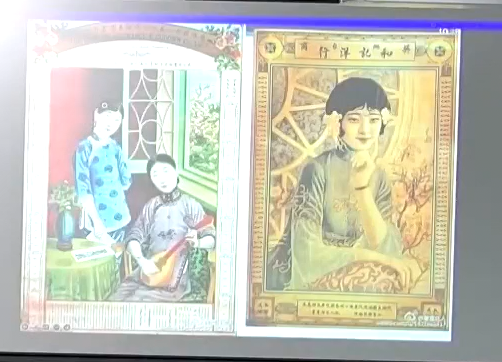
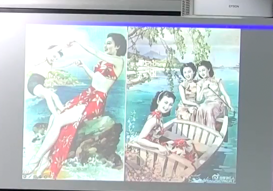

# 第 5 讲 民国广告发展历程概述

报刊广告（以《申报》为代表，现代代理制），宣传画

## 报纸广告
媒体是盈利机构，媒体资源有限（报纸版面，电视时间——黄金时间）  
以广告代理制为主要收入来源的现代传媒体系

第一份中文报纸，1815 年 《察世俗每月统记传》。英国传教士创办（新教）。在马来西亚编辑，再发送到中国。  
有教会资助，不需要自负盈亏。

民国第一大报——《申报》  
原名《申江新报》，1872 年 4 月 30 日在上海创刊，1949 年 5 月 27 日停刊。  
近代中国发行时间最久，具有广泛社会影响的报纸，是近代中国发行时间最久、具有广泛社会影响的报纸，是中国现代报纸开端的标志。  
前后经营 77 年，历经晚清、北洋政府、国民政府三个时代。  
中国近代现代史的“百科全书”。  
商业报纸。信息零碎和随意，深度报告和报道不够，迎合读者兴趣（短平快）。

广告形态极为丰富。在创刊号上就已经体现。  
《申报》创刊号（1872）：“本馆条例”：苏杭等处地方有欲告白者，即向该卖报店司人说明某街坊、某生理，并须作速寄来该价，另加一半为卖报人饭资。  
有人认为，这就是现代广告代理制的雏形（陈培爱《中外广告史》）。  
“告白”->“广告”  
“卖报人”->“报馆广告代理人”  
“饭资”->“广告代理费”

当时的广告标题会标注“广告”二字。

1919 年前后：  
1916 年，《东方杂志》，译文《广告与商业关系》  
1918 年，商务印书馆，译文《广告须知》  
1919 年，《东方杂志》发布《广告与道德》，《建设月刊》发表孙科的《广告心理学概论》  
1926 年，中国人撰写的第一部广告学专著蒋裕泉《实用广告学》，商务印书馆

收到技术上的限制，报纸无法印刷图片（成本很高，时间来不及）。  
《申报》上大部分图像广告都是插图。

明星代言

上海电话公司

## 月份牌画
郑曼陀  
商业画家，在照相馆画画。黑白照片上色。  
黑白照片（素描，碳晶粉）+透明水色=擦笔水彩  
仕女图（非现实存在，概念画）

月份牌：在两边印刷月份等信息。后来不再印刷月份而印刷其它信息（如商业信息），但仍以月份牌称呼。  
图片与广告内容通常无关。

杭穉英  
天主教传教士办的美术培训学校——土山湾学校（教授孤儿一些谋生技能）  
土山湾——西学东渐，传教，印刷，油画  
土山湾画馆，上海商务印书馆  
借鉴风格，迪士尼  
更加现代，色彩更加艳丽  
后自己独立出来，创办穉英画室

## 李叔同（1880-1942）
1905 年东渡日本留学，在东京美术学校学油画，同时学习音乐。  
1910 年回国，任天津北洋高等工业专业学校图案科主任教员。  
1912 年，在《太平洋报》担任文艺编辑和广告部主任。  
1912 年 10 月，《太平洋报》停刊。  
新广告观，“新广告”。

新广告观：

* 以有创意的图形为主，引起注意。  
* 降低文字、文案的重要性。  
* 木刻雕版印刷，属于传统版画范畴。  
* 除版面费外，还向客户收取创意费用。  
* 不单独列为一版，而是与新闻版面结合。

失败原因：艺术家，不善于商业运营，技术手段落后（成本高，效率低）
