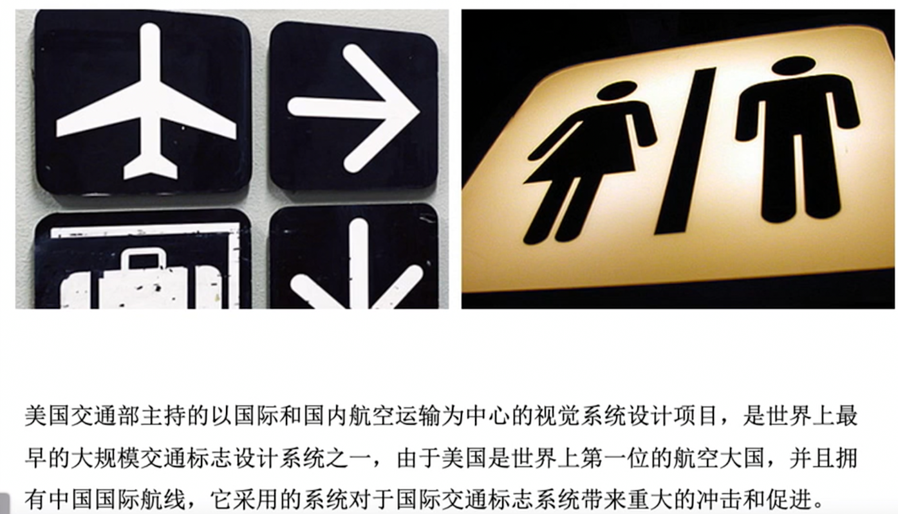
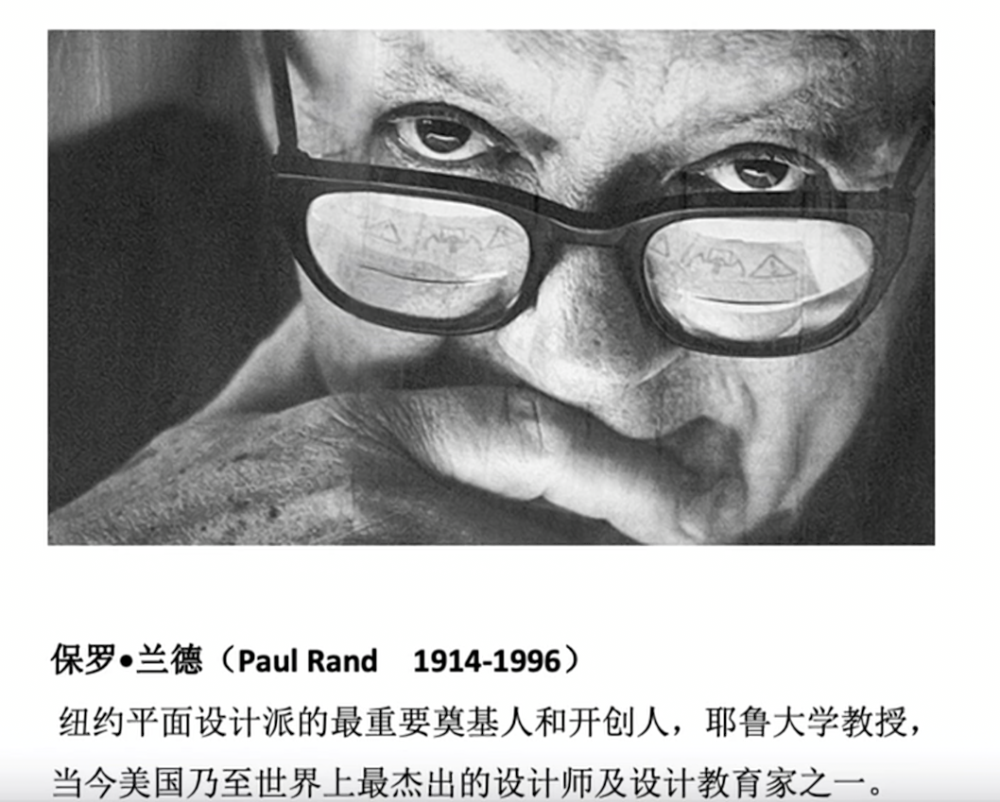

# 第 8 讲 广告与设计

科学派-艺术派

设计的本质是原创、创新

伦敦地铁，地铁线路图设计（1933 年，英国设计师亨利·贝克），曲线变直线，用颜色标注线路型号

平面设计对时代进行标注

平面设计与广告

20世纪60年代，保罗兰德和大卫奥格威分道扬镳，也是平面设计与广告逐渐分离的时期。

平面设计：对色彩、空间、版面比例、字体、图形和其它视觉形象的布局都给予高度重视。设计就是把这些复杂的因素以和谐、能够达到最佳传达目的的方式组合起来。

视觉诗人

