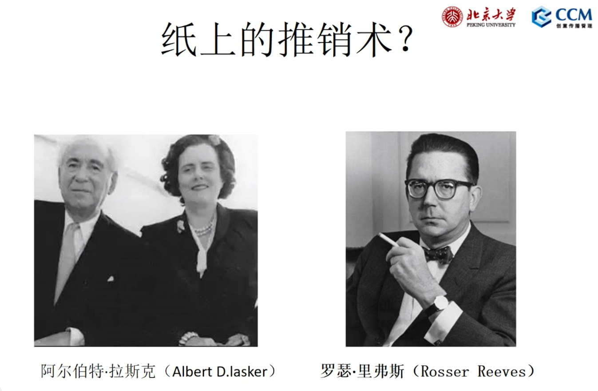
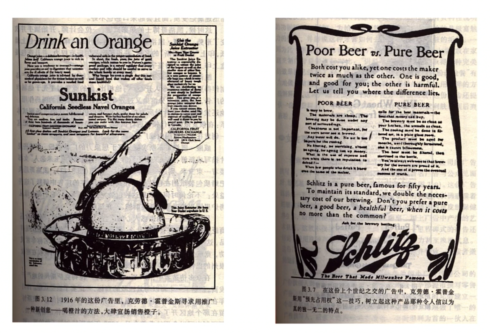
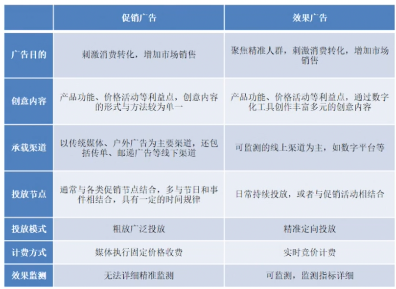
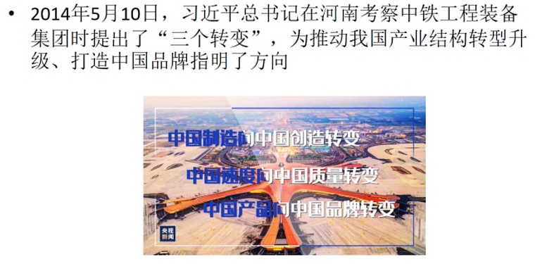
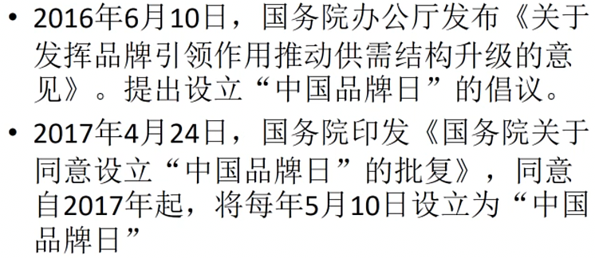
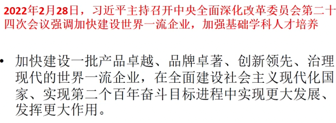
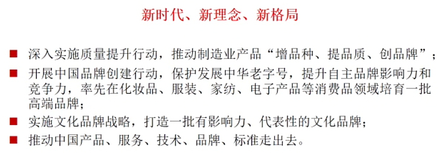
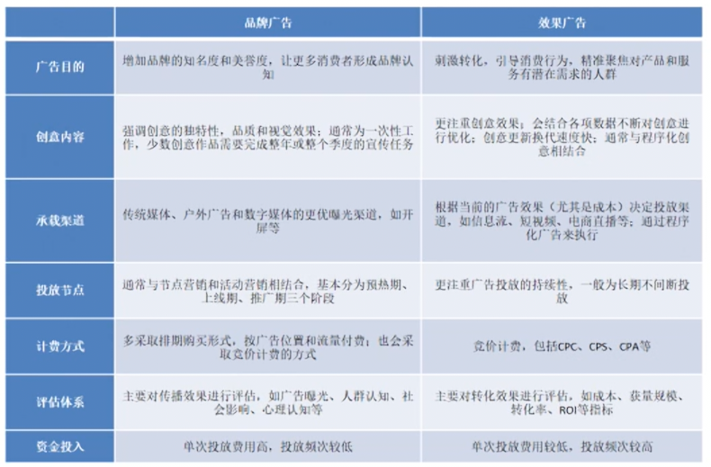

# 第 9,10 讲 广告类型

## 广告的分类
依目标市场分类：消费者广告，产业广告（将生产过程中的要素作为广告）  
地域性分类：本土广告，国际广告  
依媒体分类：大众媒介广告，户外广告，邮寄广告（通过邮局发布的信函，效果很好。在互联网大数据之前，民用的最大的数据中心在邮局、邮政系统，拥有关于家庭、社区的详细丰富的信息），网络广告，其他新型广告  
依广告目的分类：产品与非产品广告，商业与非商业广告（公益广告，但不是全都是公益广告，如政治广告、宗教广告）

## 促销广告

促销广告（产品类广告）：以广告销售为主要目的，通过告知产品的功能、价格、折扣或其他信息，影响或刺激直接的购买。

与 4P 中的促销 promotion 不同，促销广告是指在广告执行中的特定类型。  
促销广告是最常见的广告类型。  
在市场竞争的初期阶段，促销广告是最主要的广告类型。  
广告的内容以突出产品的特点为主，包括产品的功能、价格、优惠等。  
目的是影响消费决策，促进销售购买。

## 纸上的推销术

阿尔伯特拉斯克（1880年-1952年）  
阿尔伯特拉斯克所经营的洛德托马斯公司，聘请约翰肯尼迪为合伙人。到今天为止，它所顶下的原则一直是每一位文案人员的准则。  
肯尼迪：纸上的推销术（Sales in Print）（服务模式）  
肯尼迪在罗德公司建立了文案部。拉斯克意识到建立一个文案部门的重要性。他雇佣年轻的新闻工作者，根据肯尼迪的观点训练他们。就这样，拉斯克的公司成为美国历史上第一个专门系统训练文案员工的公司。（经营模式）  
推动广告公司从媒体广告代理走向文案创意（copywriter）模式。

在报纸上成功推销产品：广告的文案、策略一定要与众不同。

设立拉斯克奖（医学），以表彰在医学研究领域有突出贡献的在世科学家、医学研究者和公共服务人员或机构。基础医学研究奖、临床医学研究奖和公共服务奖，后来增设特殊贡献奖。  
被看作诺贝尔奖的风向标。

将商业上的价值反哺回社会。

USP：独特销售主张（卖掉）

## 从促销广告到效果广告
促销与创意  
促销与品牌广告的边界  
数字化与促销  
直播带货

“你知道一半广告费是浪费的，但不知道是哪一半”  
与传统时代品牌广告相对应，但不同于品牌广告提升品牌知名度的主要诉求，促销广告的核心目标是产品销售或服务推广，内容主要基于产品或服务的功能、价格、折扣以及组合优惠等其他信息，通过广告创意的方式，将这些利益点强化传达给消费者。  
通过促销广告，可以激发消费者的消费需求，影响和刺激消费者进行直接购买，最终增加市场销售。  
但受制于当时技术的发展，实际上没有办法对促销广告的转化效果进行有效检测，无法知道促销广告最终实际产生了多少效果。  
广告支出与广告效果的关系（广告主最感兴趣，但又最难以获得真实数据）

效果广告：效果广告是企业的一种营销策略，它希望在短时间内实现具体的、可衡量的财务结果，这样的目标包括提高销售额、用户留存、增加消费者忠诚度或者其它特定指标。

效果广告是数字时代为塑造品牌、推销产品或提供服务，并达到可确定的传播效果或销售转化效果，以付费的方式，通过数字平台等向生活者传播有沟通力的内容的广告活动。  
在这一定义下，效果广告具有三个典型特点：

* 其一是过程的可追溯性，包括广告主、媒体方、生活者等任何主体在效果广告过程中的所有行为和活动都会形成数据积累，并且可被追溯。  
* 其二是结果的可衡量性，效果广告投放的所有结果最终都可以通过某种方式被量化呈现和进一步分析。  
* 其三是目标的经济性，效果广告的最终会目标始终是以更少的广告成本尽可能获取更多的传播和转化。

数据+计算（在工业社会无法进行，但今天已经可以）

“针对标签而不是人做广告”

## 品牌广告
品牌广告：主要目的不仅在于推销广告，包括商品和服务，其诉求点在于建立长期品牌形象和品牌风格。

不同的市场环境和传播环境对广告类型的要求不一样。  
在国内市场，很长时间，更重要的是产品的功能和价值而不是品牌形象（否则可能影响企业的发展）。

如何理解品牌？  
品牌是手段还是目的？  
品牌能解决什么问题？  
数字化对品牌的挑战是什么？  
品牌会消失吗？

厂商制造的是有物理属性的产品，消费者购买的是有情感寄托的产品，产品会过时落伍、被竞争者模仿，而品牌则是独一无二的。真正持久的竞争优势往往来自于强势品牌。

品牌是一个名称、名词、符号或设计，或者是它们的组合，其目的是识别某个销售者或某群销售者的产品或劳务，并使之同竞争对手的产品和劳务区别开来。  
对一些天然同质化的产品而言，品牌广告是企业在市场竞争中始终使用的手段。  
但是对其他产品而言，品牌广告是在市场不断成熟导致的同质化竞争中的必要手段。

产品竞争不断升级，品牌化竞争：  
知名度，美誉度，忠诚度

物质利益（产品品牌，把促销变成品牌），情感利益（企业品牌）

品牌竞争是没有终点的竞争。随着发展可能会简化，但越来越浓缩。不需要更多的诉求，可能只需要一个简单的符号 logo 就可以联想起整个企业的形象。

今天的中国：市场竞争仍然在不断上升。人口众多，市场潜力大。  
是全球企业激烈竞争的市场，国内企业也需要升级。

过去，中国的市场主要以外贸为主，但现在我们必须强调国内的大循环。  
在以国内大循环为主体、国内国际双循环相互促进的新发展格局中，探讨品牌传播的规律和特点。  

* 本土化品牌建设实心化升级：从知名度到美誉度  
* 全球化品牌不断强化：一带一路（农村包围城市）  
* 立足本土市场，拓展全球化品牌建设：中国市场是全球最大最重要的市场，全球品牌竞争的中心。第一，中国的企业必须加强品牌建设，提升在本土市场的竞争力；第二，中国市场自身就是最激烈的全球品牌的竞争，因而，应基于中国市场，拓展本土品牌的全球化发展。

数字化对品牌传播现有理论和方法带来前所未有的冲击，需要适应数字化发展的逻辑，构建品牌数字化转型的框架与方法，在概念的辨析中不断深化对数字化品牌传播内涵的认识，在中国数字经济发展中加强数字化品牌建设。这是未来品牌传播最精彩的超级舞台。  
选择更多的转移到个人的兴趣，而不是商家的宣传。 

品牌广告主要目的不仅在于推销产品，包括商品和服务，其诉求点在于提升品牌知名度，建设长期品牌形象和品牌风格。  
品牌广告既是目的，又是手段，归根结底，还是为了企业的产品销售和市场竞争。  
促销广告也有品牌建设的作用，尤其在提升品牌知名度的方面。  
对一些天然同质化的产品而言，品牌广告是企业在市场竞争中始终使用的手段。但是对于其他产品而言，品牌广告是在市场不断成熟导致的同质化竞争中的必要手段。在更加激烈的市场环境中，品牌广告会发挥更大的作用。  
推动品牌成长，是新时代国家的重大战略需求。党的二十大提出构建高水平的市场经济体制，在其中，品牌广告应该具有新的价值。  
面对数字化的技术革命，品牌广告必须不断创新。  

## 公益广告
中国最早：1986 年，节约用水的公益广告。中央电视台，《广而告之》节目专门用于播出公益广告。  
在世界范围上，一般认为公益广告发源于二战时，美国的广告行业为反法西斯战争用于征兵和宣传等。但是更早也可以追溯到第一次世界大战期间。

通过舆论、宣传、广告以鼓动民众支持美国参加第一次世界大战。

公益广告：公共传播的特定形态，发布主体一般是公益性的组织机构，传递有益社会共同利益、推动社会发展的观念或诉求。

